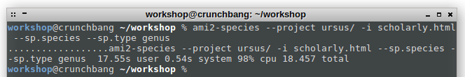
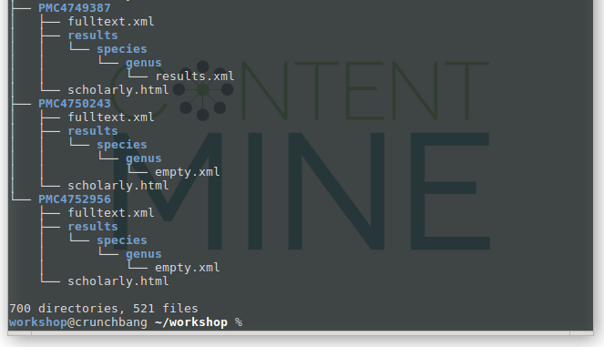

# ami
==============================

## Table of Content

1. [Description](#description)
1. [Preparations](#preparations)
1. [Input data](#input-data)
1. [Tutorial](#Tutorial)
  1. [ami2-species](#ami2-species)
  1. [ami2-gene](#ami2-gene)
  1. [ami2-sequence](#ami2-sequence)
  1. [ami2-regex](#ami2-regex)
  1. [ami2-word](#ami2-word)
  1. [Summarization of results](#summarization-of-results)
1. [Summary](#summary)
1. [Next Steps](#next-steps)
1. [Further Materials](#further-materials)

## Description

**What does ami?**

Ami is a collection of plugins that extract pieces of information (a 'fact') from structured documents. It uses dictionaries or regexes to look up various fact sets, such as species names, gene or protein sequences.
At this stage individual facts which are spread over the corpus of papers are extracted and collected into machine readable XML files, which can then be used for visualization or statistics.
We are integrating new dictionaries to cover different types of encoded knowledge, please drop us a message if you have an idea or resource for a new fact extractor!

**Why do we need ami?**

ami helps researchers with repetitive cognitive tasks like pattern matching, which e.g. has to be done when trying to keep up-to-date with new species occurrences or tracking one specific gene. ami also helps coping with large amounts of literature that has to be filtered, e.g. for meta-studies, by highlighting the papers which are really necessary to read.

**How can I use ami?**

Ami is to be used after the normalization of papers happened. You take the output of [norma](../norma/README.md) and apply a plugin.

**What you will learn here**

This tutorial shows you:
- how to use the species plugin
- how to use the genes plugin
- how to use the sequences plugin
- how to use regular expressions
- what to do with the extracted facts

**How to use the tutorial**

We have some conventions which will be used through-out the tutorial.
- Variables as placeholders are always caps, like NAME, YOURDIRECTORY etc.


**Glossary**


## Preparations
### Pre-Requisites

### Used Software
- [Future TDM Virtual Machine](LINK)
- ami2-species
- ami2-gene
- ami2-sequence
- ami2-regex

### Installation

On the ContentMine-VM ami is already provided. If you want to install it locally or update it on the VM, please refer to the [installation instructions](http://contentmine.github.io/) for your platform.

You can find the technical documentation for `ami` in its [repository](https://github.com/ContentMine/ami-plugin).

## Input data

The input for ami is always a [CProject](../cproject) containing documents in [scholarly HTML](../sHTML). ami then applies one of the available plugins, extracts the relevant content from the sHTML, and stores the results in the respective paper folder. ami-plugins require `scholarly.html`-files as input. Please follow the instructions for [norma](../norma/norma-tutorial.md). Your project directory should look like this:

```bash
tree ursus
ursus/
├── eupmc_results.json
├── fulltext_html_urls.txt
├── PMC3893193
│   ├── fulltext.xml
│   └── scholarly.html
├── PMC3893247
│   ├── fulltext.xml
│   └── scholarly.html
├── PMC3898307
│   ├── fulltext.xml
│   └── scholarly.html
...
```

## Tutorial

This tutorial is based on release [0.2.24](https://github.com/ContentMine/ami/releases).

### ami2-species

You can then search for all occurences of a species name with
```bash
ami2-species --project CPROJECTFOLDER -i INPUTFILE --sp.species --sp.type SPECIESTYPE
```

You have to choose between three different types of species terms for ```SPECIESTYPE```
- ```genus```, which will extract terms like *Brachiosaurus* [more details](https://en.wikipedia.org/wiki/Genus)
- ```binomial```, which will extract terms like *B. altithorax* [more details](https://en.wikipedia.org/wiki/Binomial_nomenclature)
- or ```genussp```, whick will extract terms like *Bacillus sp* or *Ursus spp.*

```bash
ami2-species --project ursus/ -i scholarly.html --sp.species --sp.type genus
```



Inspecting the folders with `tree ursus` now should look like the following. If no matches could be found, an **empty.xml** will be created, to indicate that the plugin has been run on this particular paper, but with no results. If matches have been found, a **results.xml** will be created.



A for-loop performs all extractions in sequence:
```
for type in genus binomial genussp; do
ami2-species --project ursus/ -i scholarly.html --sp.species --sp.type $type;
done
```

The results will all be saved as XML in the corresponding CTree inside results/species with per-type folder named after the SPECIESTYPE.

```
tree ursus
ursus
├── eupmc_results.json
├── fulltext_html_urls.txt
├── PMC3893193
│   ├── fulltext.xml
│   ├── results
│   │   └── species
│   │       ├── **binomial**
│   │       │   └── results.xml
│   │       ├── **genus**
│   │       │   └── results.xml
│   │       └── **genussp**
│   │           └── results.xml
│   └── scholarly.html
├── PMC3893247
│   ├── fulltext.xml
│   ├── results
│   │   └── species
│   │       ├── **binomial**
│   │       │   └── results.xml
│   │       ├── **genus**
│   │       │   └── results.xml
│   │       └── **genussp**
│   │           └── results.xml
│   └── scholarly.html
...
```

```bash
cat ursus/PMC4349051/results/species/genussp/results.xml
```

```xml
<?xml version="1.0" encoding="UTF-8"?>
<results title="genussp">
 <result pre="t very strongly arched, as is the case in adult lambeosaurines and unlike young individuals (e.g., " exact="Parasaurolophus sp" match="Parasaurolophus sp" post=". RAM 14000). These different angles are possibly a consequence of more strongly arched frontals in" name="genussp"/>
 <result pre=" and 1/240; Saveliev, Alifanov &amp;amp;amp; Bolotsky, 2012; Lauters et al., 2013) and the subadult of " exact="Corythosaurus sp" match="Corythosaurus sp" post=". (CMN 34825; Evans, Ridgely &amp;amp;amp; Witmer, 2009). The olfactory bulbs are turned downward with " name="genussp"/>
 <result pre="ampullae, the lateral ampulla is larger than the posterior ampulla and the anterior ampulla, as in " exact="Parasaurolophus sp" match="Parasaurolophus sp" post=". RAM 14000 ( Farke et al., 2013) and unlike in Hypacrosaurus altispinus ROM 702 and Lamb" name="genussp"/>
 <result pre=" sp. RAM 14000 ( Farke et al., 2013) and unlike in Hypacrosaurus altispinus ROM 702 and " exact="Lambeosaurus sp" match="Lambeosaurus sp" post=". ROM 758 ( Evans, Ridgely &amp;amp;amp; Witmer, 2009), where the anterior ampulla is the largest, foll" name="genussp"/>
</results>
```

The results.xml consists of different amounts of lines, where every line represents one extracted fact inside the `<result>`-tag and consists of:
-  `exact`: the exact match - the fact. e. g. `exact="Parasaurolophus sp" for the fact "Parasaurolophus sp"
- `pre`: 99 characters before the match
- `post`: 99 characters after the match

Down to earth, this is what the fact extraction looks like in the end: a list of terms extracted from the literature with XX characters before and afterwards as context around the fact.


### ami2-gene

The search for genes works in the same way, just with another command:
```bash
ami2-gene --project CPROJECTFOLDER -i INPUTFILE --g.gene --g.type GENETYPE
```

At the moment there is only one GENETYPE available (`human`). Results are again stored within the CTree.

```bash
ami2-gene --project ursus/ -i scholarly.html --g.gene --g.type human
```

This then creates a folder gene/human inside results next to the results of the species module.

```
tree ursus
ursus
├── eupmc_results.json
├── fulltext_html_urls.txt
├── PMC3893193
│   ├── fulltext.xml
│   ├── results
│   │   └── gene
│   │       └── human
│   │           └── results.xml
│   └── scholarly.html
├── PMC3893247
│   ├── fulltext.xml
│   ├── results
│   │   └── gene
│   │       └── human
│   │           └── results.xml
│   └── scholarly.html
...
```

The `results.xml` has a similar structure: a results-tag with pre, post, and exact attributes.

```
cat ursus/PMC4454486/results/gene/human/results.xml
```

```xml
<?xml version="1.0" encoding="UTF-8"?>
<results title="human">
 <result pre=" individual vertebrae in Cretoxyrhina mantelli. The relationship between centrum diameter ( " exact="CD" post=" in mm) and total length ( TL) can be estimated with the following formula: " name="human"/>
 <result pre="hina mantelli. The relationship between centrum diameter ( CD in mm) and total length ( " exact="TL" post=") can be estimated with the following formula: " name="human"/>
</results>
```

### ami2-sequence

The search for sequences follows the same structure:
```bash
ami2-sequence --project CPROJECTFOLDER -i INPUTFILE --sq.sequence --sq.type SEQUENCETYPE
```

- SEQUENCETYPE is one of `dna rna prot prot3 carb3`.

You can run one type with this query:
```bash
ami2-sequence --project ursus/ -i scholarly.html --sq.sequence --sq.type rna
```

You can also run all types in sequence with this loop:
```bash
for type in dna rna prot prot3 carb3; do
ami2-sequence --project ursus -i scholarly.html --sq.sequence --sq.type $type;
done
```

This creates an own folder called `sequence/sequencetype` inside results. The results are in general of the same structure as before, with an additional attribute `xpath` that shows the location of the match within the html-structure of the `scholarly.html`.

```bash
cat ursus/PMC4447998/results/sequence/rna/results.xml
```

```xml
<?xml version="1.0" encoding="UTF-8"?>
<results title="rna">
 <result pre="the oligonucleotides, within NR3C1 (GenBank #AY436590) is the following: NR3HumF: 5′-TTTGAAGTTTTTTT" exact="AGAGGG" post="-3′ and NR3HumR: 5′-biotin-7-CCCCCAACTCCCCAAAAA-3′ (adapted from Oberlander et al., 2008). Amplific" xpath="/html[1]/body[1]/div[1]/div[4]/div[2]/div[8]/p[3]" name="rna"/>
 <result pre="(GenBank #AY436590) is the following: NR3HumF: 5′-TTTGAAGTTTTTTTAGAGGG-3′ and NR3HumR: 5′-biotin-7-" exact="CCCCCAAC" post="TCCCCAAAAA-3′ (adapted from Oberlander et al., 2008). Amplification resulted in a 403 bp fragment (" xpath="/html[1]/body[1]/div[1]/div[4]/div[2]/div[8]/p[3]" name="rna"/>
 <result pre="#AY436590) is the following: NR3HumF: 5′-TTTGAAGTTTTTTTAGAGGG-3′ and NR3HumR: 5′-biotin-7-CCCCCAACT" exact="CCCCAAAAA" post="-3′ (adapted from Oberlander et al., 2008). Amplification resulted in a 403 bp fragment (position-3" xpath="/html[1]/body[1]/div[1]/div[4]/div[2]/div[8]/p[3]" name="rna"/>
</results>
```

### ami2-regex

Regex is the shortcut for ([regular expression](https://en.wikipedia.org/wiki/Regular_expression)) and is used to match search patterns inside text. This means to search for such basic strings like "ursus" inside a sentence, but also allows way more complex patterns to look for, `[Uu]rsus` matches for example upper and lower case letters, so you look at the same time for Ursus and ursus.

Digits can be added by e.g. `[0-9]`, which matches any digit, or by fixed sequences `(00111001)`. Non-alphanumeric characters have to be escaped by `\`, so if you want to search for the number 3.14 explicitly, the regex looks like `(3\.14)`.

We will now see a variety of regex-s and how they are used in a XML file.

**How to use regex with ami**


```bash
ami2-regex --project CPROJECTFOLDER -i INPUTFILE --context PRE POST --r.regex REGEXFILE.xml
```.

- `PRE`: tells ami how many characters before a match should be captured
- `POST`: tells ami how many characters after a match should be captured
- `REGEXFILE`: target location of your regex XML file. It contains all regex--projectueries.

**How to create a custom regex XML file**

The REGEXFILE.xml needs to be wrapped by `<compoundRegex title="TITLE">` and closing tags `</compoundRegex>`, which are the opening and closing tags. The `TITLE` sets the name of the folder, where the output gets stored.

```xml
<compoundRegex title="ursusfood">
</compoundRegex>
```

In the regex XML each regex-query is written to a new line, and consists of the opening and closing tags `<regex></regex>`. Within the opening tag there must be two attributes declared,
- `weight`: the relative importance given to each match (influences indexing engines). The default value `1.0`
- `fields`: corresponds to the regex-query, and specifies the name of the query

```xml
<compoundRegex title="ursusfood">
<regex weight="1.0" fields="food"></regex>
<regex weight="1.0" fields="predator"></regex>
</compoundRegex>
```

What is missing now is the regex-query itself. It is placed between the regex-tags `<regex>query</regex>`and is framed by round brackets `()`.

In line two one field ("food") is defined. We want to get both upper and lower cases, and `[Ff]` matches either `F` or `f`: `([Ff]ood)`. The following characters `ood` are fixed for this query, they have to be matched.

For the second query, we want to find all mentions of "predator regime" or "predator regimes". For this we need `\s`, a special character standing for ` ` - the whitespace, blank character. The questions mark `[s]?` makes the "s" optional: `([Pp]redator\sregime[s]?)`

```xml
<compoundRegex title="ursusfood">
<regex weight="1.0" fields="food">([Ff]ood)</regex>
<regex weight="1.0" fields="predator">([Pp]redator\sregime[s]?)</regex>
</compoundRegex>
```

We now construct a ```regex.xml``` like that (use any texteditor for that) and place this XML in our project folder as `ursusfood.xml`. We run ami with it, and because we want to get some context around our matches, add the ```PRE``` and ```POST``` option, which capture characters before and after the match.

```bash
ami2-regex --project ursus/ -i scholarly.html --r.regex ursus/ursusfood.xml --context 50 50
```

The output contains 50 characters `pre` and 50 characters `post` the `value0`, as well as the `xpath` of the match in the scholarly.html.

### ami2-word

Word frequency can be used to categorize documents. The simplest approach is to count the words in documents, or within chunks of documents.

```bash
ami2-word --project ursus/ -i scholarly.html --w.words wordFrequencies
```
creates
```
eupmc
├── eupmc_results.json
├── fulltext_html_urls.txt
├── PMC2275095
│   ├── fulltext.xml
│   ├── results
│   │   └── word
│   │       └── frequencies
│   │           ├── results.html
│   │           └── results.xml
│   └── scholarly.html
├── PMC2586803
│   ├── fulltext.xml
│   ├── results
│   │   └── word
│   │       └── frequencies
│   │           ├── results.html
│   │           └── results.xml
```

The first lists word frequencies as:

```
<?xml version="1.0" encoding="UTF-8"?>
<results title="frequencies">
 <result title="frequency" word="the" count="233"/>
 <result title="frequency" word="and" count="188"/>
 <result title="frequency" word="miR-" count="99"/>
 <result title="frequency" word="were" count="77"/>
 <result title="frequency" word="with" count="68"/>
 <result title="frequency" word="for" count="57"/>
 <result title="frequency" word="The" count="50"/>
 <result title="frequency" word="was" count="49"/>
```

and the second creates a "Word Cloud"-like HTML display with the most frequent words in order and with fonts proportional to the count. This mainly reflects the frequency in the English language, so we can remove the commonest words by using *stopwords*. We have a range of stopword files in different languages. It is also possible to create your own files and add them.

```bash
ami2-word --project ursus --w.words wordFrequencies --w.stopwords STOPWORDS.txt
```

The format is a simple list of words:
```
a
about
above
across
after
afterwards
again
against
```

and the file can be referenced either through a URL format or relative/absolute filename.

```bash
ami2-word --project ursus/ -i scholarly.html --w.words wordFrequencies --w.stopwords stopwords.txt
```

gives `results.xml` as
```
<?xml version="1.0" encoding="UTF-8"?>
<results title="frequencies">
 <result title="frequency" word="miR-" count="99"/>
 <result title="frequency" word="LNA-antimiR" count="49"/>
 <result title="frequency" word="mice" count="39"/>
 <result title="frequency" word="liver" count="35"/>
 <result title="frequency" word="using" count="32"/>
 <result title="frequency" word="Figure" count="28"/>
 <result title="frequency" word="levels" count="28"/>
 <result title="frequency" word="control" count="28"/>
 <result title="frequency" word="expression" count="25"/>
 <result title="frequency" word="miRNA" count="24"/>
```

### Summarization of results

ami-plugin possesses the ability to automatically create an aggregation of results. It is possible to aggregate the results over all plugins with:

```
ami2-sequence --project ursus --filter file\(\*\*/results.xml\) -o sequencesfiles.xml
```

It is possible to only aggregate results for a specific plugin and option, e.g. for `dna`:
```
ami2-sequence --project ursus --filter file\(\*\*/dna/results.xml\)xpath\(//result\) -o dnasnippets.xml
```


## Summary

* A project folder containing ctrees is always the input.
* Plugins are own software parts with own commands.
* Rsults/Facts are stored within the ctree in a plugin-specific folder.
* Results also store the context of 99 characters before and after the fact.

**Next steps**

* Back to the [tutorial overview](..)

## Further material

**ContentMine**
- [contentmine.org](http://contentmine.org)
- office ett contentmine dot org
- [@TheContentMine](http://twitter.com/thecontentmine)

**Slides**


**Assets**

**Videos**


**Learning Materials**

**www**


**Papers**
