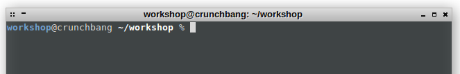
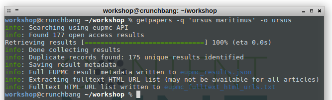
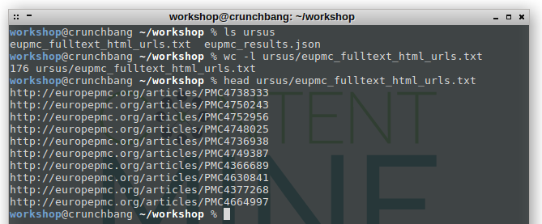

# getpapers

This tutorial covers the installation of getpapers, demonstrates how to construct simple and more complex queries, and shows what output can be expected from getpapers.

## Table of contents

1. [Description](#description)
1. [Preparations](#preparations)
  1. [Installation](#installation)
  1. [Input data](#input-data)
1. [Tutorial](#tutorial)
  1. [Construct a simple query and compare results](#construct-a-simple-query-and-compare-results)
  1. [Getting pdfs and other files](#getting-pdfs-and-other-files)
  1. [Complex queries for EPMC](#complex-queries-for-epmc)
1. [Summary and next steps](#summary-and-next-steps)

## Description

**What is getpapers?**

`getpapers` is together with [quickscrape](../quickscrape/README.md) one of the entry points of the ContentMine pipeline. getpapers fetches article metadata, fulltexts (PDF or XML), and supplementary materials. It is designed for use in content mining, but you may also find it useful for quickly acquiring large numbers of papers for reading or for bibliometrics. getpapers accesses different publisher APIs (currently EUPMC, IEEE, Arxiv), queries them for search terms and returns metadata, PDFs or XMLs. In contrast, quickscrape takes URLs as input and scrapes the whole page.

**Why do we need getpapers?**


**How can I use getpapers?**


**Glossary**
- JSON ([Wikipedia](https://en.wikipedia.org/wiki/JSON))
- XML ([Wikipedia](https://en.wikipedia.org/wiki/XML))
- API ([Wikipedia](https://en.wikipedia.org/wiki/API))
- Query


## Preparations

### Prerequisites

### Installation

Open a terminal and type: `getpapers --version` at the commandline. If `0.4.1` appears, getpapers is installed, you can skip this section.

To install it within the ContentMine virtual machine:
```
npm install --global getpapers
```

Elsewhere you need to have node and node package manger installed. You may need to be a superuser and type:
```
sudo npm install --global getpapers
```

If you are a developer you can find the technical documentation for `getpapers` in its [repository](https://github.com/ContentMine/getpapers).

### Input data

In this tutorial we will mainly use open access literature from [Europe PMC](http://europepmc.org/). We can search within their database of 3.5 million fulltext papers from life-sciences. About one million of these are Open Access. Please refer to [Europe PMC-Data](http://europepmc.org/FtpSite) for details. 

 

## Tutorial

After starting the VM, we open a terminal and navigate to the getpapers folder:

```
cd getpapers
```



### Construct a simple query and compare results

We now will check how many results we can expect for a search for `ursus maritimus` on Europe PMC. With the `-n` flag getpapers will report how many results match the query, but it will not actually download anything. Without a specification of the API, getpapers will chose Europe PMC as default data source.

```
getpapers -q 'ursus maritimus' -n -o ursus
getpapers -q ursus maritimus -n -o ursus
```


Please note the different result numbers. With quotation marks `-q 'ursus maritimus'` searches for the exact match, while `-q ursus maritimus` is not as constrained and returns also matches for only `ursus` or `maritimus`.

In the next step we will download the metadata of our results. To keep waiting times low we use the more narrow search. If you chose a too large result set and don't want to wait, you can abort the query with `Ctrl + C`.
```
getpapers -q 'ursus maritimus' -o ursus
```


This query creates two files, `eupmc_fulltext_html_urls.txt` and `eupmc_results.json` and stores them in the `ursus` folder. It can happen that no fulltexts are available for the query, in which case the file `fulltext_html_urls.txt` will not be created. We now have a look at the contents of the `eupmc_fulltext_html_urls.txt` file, which contains a list of HTML-sources for results. Depending on Europe PMC, not all search results necessarily have a downloadable HTML-version of the paper.
```
ls ursus
wc -l ursus/eupmc_fulltext_html_urls.txt
head ursus/eupmc_fulltext_html_urls.txt
```


The `eupmc_results.json` file contains metadata about each search results in the [JSON](https://en.wikipedia.org/wiki/JSON)-format. Metadata are e.g. a DOI, the title, authors, and additional bibliographic data.

### 3. Getting pdfs and other files

Until now, our queries only resulted in metadata and a list of urls. PDF files can be retrieved by adding a `-p` flag to the query. Please note, that a **generic query** will result in a **large number of results** and long processing times. Unless intended, you can cancel a search with `Ctrl+C` in the command line.

```bash
getpapers -q 'ursus maritimus' -o ursus -p
```

For every PDF found, getpapers creates a subfolder named after the Europe PMC paper ID which holds the fulltext.pdf and any future additional files. To have a look at folder file structure, use the ```tree``` command.

```
tree ursus
```

Not all queries returned PDFs, we now try another query with `-x` for xml-results. In contrast to PDF, XML is a format that machines can understand well, and XML enables better mining results further down the pipeline.

```bash
getpapers -q 'ursus maritimus' -o ursus -x
```

The existing resultfolders get updated, no results are lost or overwritten.

```
tree ursus
```

As a last step, we will download supplementary information. Europe PMC provides supplementary information in compressed ZIP-files.

```bash
getpapers -q 'ursus maritimus' -o ursus -s
```

```
tree ursus
```


This is the [ctree](../ctree/README.md)-structure, which is the main data structure of the ContentMine pipeline, and any further operations are going to be centered around the ctree.

### Complex queries for EuropePMC

Queries are directed to the [Europe PMC API](http://europepmc.org/RestfulWebService). In their simplest form, they can be free text, like this one we executed before (`getpapers -q 'ursus maritimus' -o ursus -x`).

Using the EuropePMC webservice's query language we can construct much more detailed queries. A selection of the most commonly useful search fields is explained [here](getpapers-eupmc-queries.md), and a complete documentation of possible queries is in Appendix I of the [EuropePMC reference PDF](http://europepmc.org/docs/EBI_Europe_PMC_Web_Service_Reference.pdf).

For example we can restrict our search to only papers that mention 'ursus maritimus' in the abstract. The query is the same that would be entered in the search field on the Europe PMC website.

```bash
getpapers -q ABSTRACT:ursus maritimus -o ursus -n
getpapers -q ABSTRACT:'ursus maritimus' -o ursus -n
```

Please compare again the different result numbers without and with `''`.

We can use the logical operations `AND` and `OR`, and can group operations using brackets. Please note that in the shell we have to encapsulate the query with `'` when we use brackets and use double quotations for inner groupings.

```bash
getpapers -q '(LICENSE:"cc by" OR LICENSE:"cc-by") AND ABSTRACT:"ursus maritimus"' -o ursus -n
```

Search for papers which contain the phrase "ursus maritimus" in the introduction section and the phrase "survey" in the methods section.
```bash
getpapers -q 'INTRO:"ursus maritimus" AND METHODS:survey' -o ursus -n
```

Search for papers where the authors contain "Smith" and which were published in either "Biology" or "Cell". You can look up journals on the [Europe PMC journal list](http://europepmc.org/journalList?journals) by clicking on the magnifying glass in the column "Search this Journal".
```bash
getpapers -q 'AUTH:Smith AND (JOURNAL:biology OR JOURNAL:cell)' -o ursus -n
```

Downloads XML and PDF's for papers that contain "ursus maritimus" in the abstract and were published between 2010 and 2013.
```bash
getpapers -q 'ABSTRACT:"ursus maritimus" AND PUB_YEAR:[2010 TO 2013]' -o ursus -p -x
```

Search for papers that contain "ursus maritimus" in the title and were first published between July 2009 and June 2013.
```bash
getpapers -q 'TITLE:"ursus maritimus" AND FIRST_PDATE:[2009-07-01 TO 2013-06-30]' -o ursus -n
```

Search for papers about "ursus maritimus" where the European Research Council ("ERC") is mentioned in the acknowledgements section.
```bash
getpapers -q '"ursus maritimus" AND (ACK_FUND:ERC OR ACK_FUND:"European Research Council")' -o ursus -n
```

You can find some common query options [here](getpapers-eupmc-queries.md).

## Summary and next steps

A query must consist of `-q 'QUERY' -o OUTPUTDIRECTORY`.
* QUERY: the term(s) you want to look for.
* OUTPUTDIRECTORY: Folder in which you want the output files and directory. The folder will be created if it does not already exist.
This query creates a ```eupmc_results.json``` file in the named directory, in which a detailed, lengthy file containing metadata (e.g. doi, publication id, authors, ...) in an {key:value}-format is stored.

* Use `-x` for machine-readable fulltext results, because XML-files provide better mining results in later stages of the tool chain.
* Use `-p` if you want to retrieve human-readable fulltexts in PDF-format.
* By default, only Open Access papers will be returned.
* Each API has a different native query language, please refer to the documentation ([EUPMC](getpapers-eupmc-queries.md), [ArXiv](getpapers-arxiv-queries.md), [IEEE](getpapers-ieee-queries.md))

**Next steps**
* Go back to the [tutorial overview](..)
* Continue to [quickscrape](../quickscrape/README.md) for an introduction to scraping.
* Continue to [norma](../norma/README.md) for the next step of the ContentMine pipeline.
* Continue to [ctree](../ctree/README.md) for an introduction of the main datastructure.
