.png)

## What are journal scrapers?


Journal scrapers are used in [quickscrape](../quickscrape/quickscrape-tutorial.md) to find and extract specific pieces of content from a website. What you see whenyou open a website is your browsers visual interpretation of HTML (content) and CSS (layout). A scraper takes the HTML, takes a certain piece of content (author names, doi, a heading, a paragraph) and restructures it into a format that is re-usable by machines. 

In academic literature the types of content are the same, even between disciplines - journal layouts on the other hand vary wildy. ContentMine aims to offer a comprehensive collection of scrapers (maintained in [this repo](https://github.com/ContentMine/journal-scrapers)), but we - and your scientific community - need your help for that. In this tutorial we're going to cover how to contribute a scraper to the collection. We're going to look at a how a website is structured and how a scraper is defined, and we'll also walk through the github workflow in order to make the scraper definition available to the community.

[1. Types of content](#types-of-content)

[1.1 Metadata](#metadata)

[1.2 Content](#content)

[2. Scraper Definitions](#scraper-definitions)

[2.1 Selectors](#selectors)

[2.2 Followables](#followables)

[2.3 Downloads](#downloads)

[2.4. Fulltext](#fulltext)

[3. Contribution Workflow](#contribution-workflow)

[4. Receive Kudos](#receive-kudos)


### Types of content

Two different types of data are interesting for content mining, metadata (data about data) and the content itself. A scraper definition should cover both. A definition of scraperJSON is maintained [here](link).

Every journal scraper in the collection targets the same data. An ideal scraper should collect as many as possible of the elements in the list below. Words that are styled like `this` are the keywords that should be used as element names in the scraper definition.

#### Metadata

- `publisher` - the name of the publisher
- journal:
  - `journal_name`
  - `journal_issn`
  - `volume`
  - `issue`
  - `firstpage`
- `title`
- `keywords` - either a single string containing all the keywords, or each keyword can be captured separately
- authors:
  - `author_name`
  - `author_institution`
  - `author_givenName`
  - `author_familyName`
  - `author_orcid`
- date:
  - `date_published`
  - `date_accepted`
  - `date_submitted`
- identifiers:
  - `doi`
  - `pmid` - PubMed ID
- `license`
- `copyright`

#### Content

- links:
  - `fulltext_html`
  - `fulltext_pdf`
  - `fulltext_xml`
  - `supplementary_file`
- sections - generally in either/both of HTML or text. HTML versions should use the `html` attribute, while text versions should use the `text` attribute.
  - abstract:
    - `abstract_html`
    - `abstract_text`
  - introduction:
    - `introduction_html`
    - `introduction_text`
  - methods:
    - `methods_html`
    - `methods_text`
  - results:
    - `results_html`
    - `results_text`
  - discussion:
    - `discussion_html`
    - `discussion_text`
  - conclusions:
    - `conclusion_html`
    - `conclusion_text`
  - author contributions:
    - `author_contrib_html`
    - `author_contrib_text`
  - competing interests:
    - `competing_interests_html`
    - `competing_interests_text`
  - figures - currently only captured as HTML and image file download
    - `figures_html`
    - `figures_image` - a download of the image file, with no renaming
  - tables - currently only captured as HTML
    - `tables_html`
  - references - currently only captured as HTML
    - `references_html`


### Scraper definitions

Here we will create a scraper for the [IJESM](http://ijs.sgmjournals.org/) based on [this article](http://ijs.sgmjournals.org/content/journal/ijsem/10.1099/ijs.0.063172-0).

To find out where in the html a specific information is stored, you need a debug tool like [Firebug](https://addons.mozilla.org/de/firefox/addon/firebug) for Firefox or [Web Inspector](https://developer.apple.com/safari/tools/) for Safari. Open [the article](http://ijs.sgmjournals.org/content/journal/ijsem/10.1099/ijs.0.063172-0) with Firefox or Safari, and then view it with Firebug/Web Inspector - right click -> View Source. This shows the page how a machine would see it. The top 18 lines look like this:

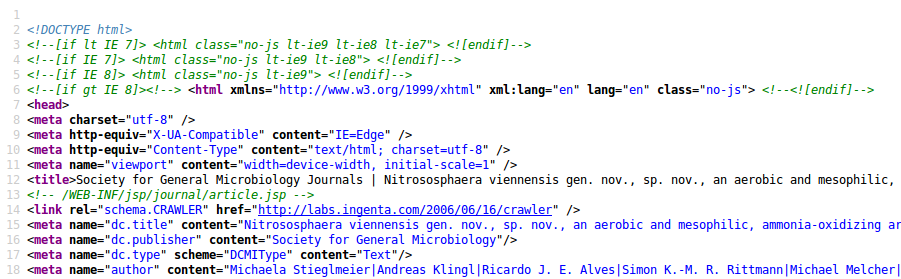

HTML may be conceptualized like a tree structure, where `head` and `meta` are tags signifying different branches, and `dc.publisher` being the `name` attribute of a branch.

```
html
├── head
│   ├── meta[dc.publisher]
│   ├── meta[citation_author]
│   ├── meta[citation_doi]
│   ...
├── body
│   └── section
│       ├── article section
│       ├── article section
│       └── article section
...
```

#### Selectors

The selectors we learn to construct are essentially [XPATH](https://en.wikipedia.org/wiki/Xpath)-queries, which you can test e.g. [here](http://videlibri.sourceforge.net/cgi-bin/xidelcgi). The mapping between a content and the extractor is stored in the JSON format in nested key-value-dictionaries. First we lay the groundwork for the scraper definition, by creating a file name `ijsem.json`. We then create the top-level dictionary that will hold the rest:

```
{
    "url": "ijs\\.sgmjournals\\.org",
    "elements": {}
}
```
On the top level are two entries, `url` and `elements`. `url` specifies the domain where the scraper definition is valid. `elements` opens a second level of entries, such as `publisher`, `doi` or `figure_caption`. Each of these entries is a dictionary itself, containing `selector`, `attribute`, and optionally `download`. The two backslash `\\` are escape characters so that the scraper recognizes a dot `.` as a dot and not as placeholder.


We find information about the publisher in line 16, in the `meta` tag, identified by `dc.publisher` in the `name` attribute (referring to the name of the tag, not the name of the publisher), with the value in the `content` attribute. The `publisher` element of the scraper definition then looks like this:

```
"publisher": {
      "selector": "//meta[@name='dc.publisher']",
      "attribute": "content"
    }
```

The value in `"selector"` starts with "//meta" signifying the tag, and `[@name='dc.publisher']` specifying *which* meta tag to choose. The two `//` indicate that we don't care about whats higher up in the hierarchy, so quickscrape will find *any* `meta` tag regardless of where it appears in the tree structure. Square brackets `[]` signify a condition, that means the `meta` tag is selected only if the `name` attribute equals to 'dc.publisher'.


Our scraper now contains the first element, and looks like this:
```
{
    "url": "ijs\\.sgmjournals\\.org",
    "elements": {
        "publisher": {
            "selector": "//meta[@name='dc.publisher']",
            "attribute": "content"
        }
    }
}
```

We add some bibliographic metadata, `journal_name`, `journal_issn`, `volume`, `issue`, and `firstpage`. They can be found in lines 45, 46, 64, 65 and 66, specified by `name` and with the data in `content`.

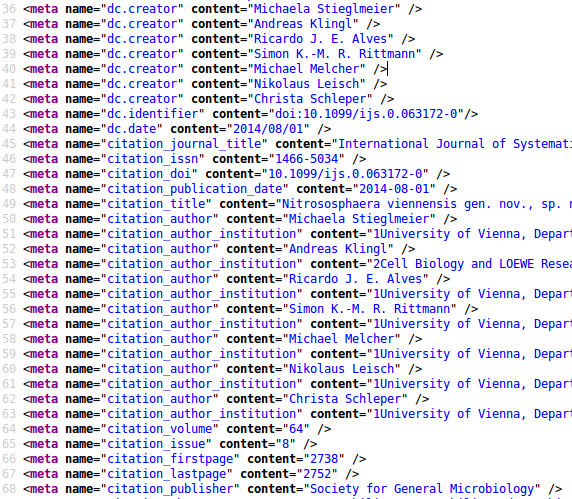

The selectors are short, because the combinations of `meta`-tag and each `name` attribute are unique. Some parts of the document will require more complex queries involving multiple tags and conditions, in order to uniquely identify an element. Our scraper now looks like this:

```
{
  "url": "ijs\\.sgmjournals\\.org",
  "elements": {
    "publisher": {
      "selector": "//meta[@name='dc.publisher']",
      "attribute": "content"
      },
    "journal_name": {
      "selector": "//meta[@name='citation_journal_title']",
      "attribute": "content"
      },
    "journal_issn": {
      "selector": "//meta[@name='citation_issn']",
      "attribute": "content"
      },
    "volume": {
      "selector": "//meta[@name='citation_volume']",
      "attribute": "content"
      },
    "issue": {
      "selector": "//meta[@name='citation_issue']",
      "attribute": "content"
      },
    "firstpage": {
      "selector": "//meta[@name='citation_firstpage']",
      "attribute": "content"
      }
  }
}
```

We add any further metadata we can find in the `meta`-section, please have a thorough look through the source code to get an impression of the data. If some information is not present for some journals, in this case e.g. `keywords` or `author_orcid`, we skip these elements. Our scraper now should look like this:

```
{
  "url": "ijs\\.sgmjournals\\.org",
  "elements": {
    "publisher": {
      "selector": "//meta[@name='dc.publisher']",
      "attribute": "content"
      },
    "journal_name": {
      "selector": "//meta[@name='citation_journal_title']",
      "attribute": "content"
      },
    "journal_issn": {
      "selector": "//meta[@name='citation_issn']",
      "attribute": "content"
      },
    "volume": {
      "selector": "//meta[@name='citation_volume']",
      "attribute": "content"
      },
    "issue": {
      "selector": "//meta[@name='citation_issue']",
      "attribute": "content"
      },
    "firstpage": {
      "selector": "//meta[@name='citation_firstpage']",
      "attribute": "content"
      },
    "title": {
      "selector": "//meta[@name='citation_title']",
      "attribute": "content"
      },
    "author_name": {
      "selector": "//meta[@name='citation_author']",
      "attribute": "content"
      },
    "author_institution": {
      "selector": "//meta[@name='citation_author_institution']",
      "attribute": "content"
      },
    "date_published": {
      "selector": "//meta[@name='citation_publication_date']",
      "attribute": "content"
      },
    "doi": {
      "selector": "//meta[@name='citation_doi']",
      "attribute": "content"
      }
  }
}
```

#### Followables

We now proceed to the content, unfortunately with this journal this is not as straightforward as the metadata. Downloads for PDF are behind links, and fulltext, figures, and supplementary data are on different tabs. It is not possible to find the content within the source view of the page, since it is hidden behind scripts.

We therefore have to define `followables`, that quickscrape then can follow to the real content. We do this as an extra entry between `url` and `elements`. After switching to the `Fulltext`-tab, you can find the selectors and attributes by clicking on fulltext, right clicking on the text of the introduction and choosing `Inspect element (Q)`. This opens a firebug window, the fulltext can be found by quickscrape through following the `div` tag with the `id='itemfulltext'` to the `data-fulltexturl`. 

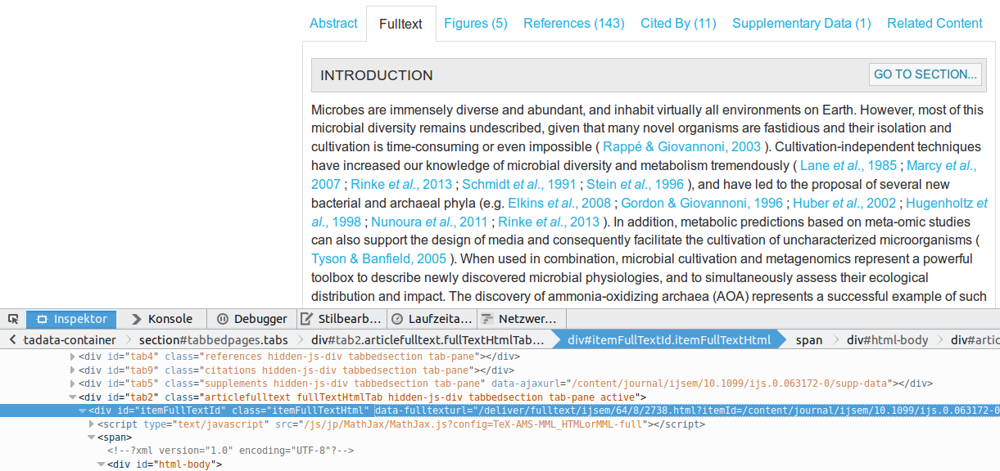

```
"fulltext_expansion": {
      "selector": "//div[@id='itemFullTextId']",
      "attribute": "data-fulltexturl"
    }
```
If you mouseover a line in the inspector, it highlights the corresponding element in the browser. For the case of the `Figures`-tab, we aim to select the element which contains all figures, and not a single one.

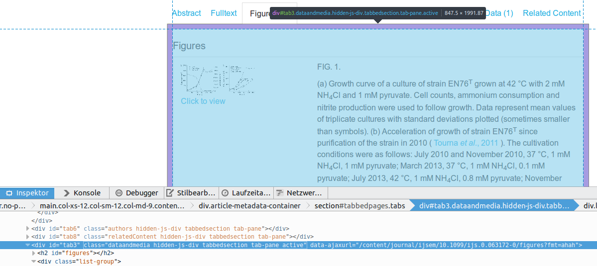

```
"figure_expansion": {
      "selector": "//div[@id='tab3']",
      "attribute": "data-ajaxurl"
    }
```

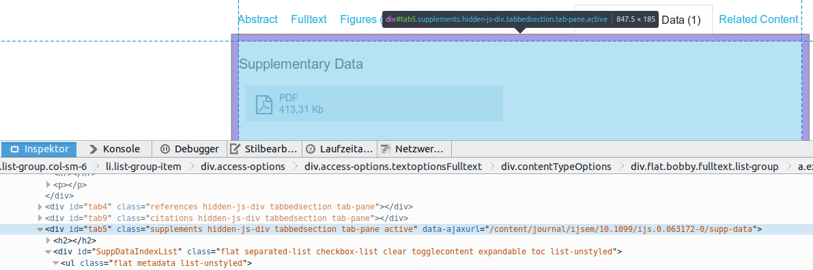


```
{
  "url": "ijs\\.sgmjournals\\.org",
  "followables": {
    "fulltext_expansion": {
      "selector": "//div[@id='itemFullTextId']",
      "attribute": "data-fulltexturl"
    },
    "figure_expansion": {
      "selector": "//div[@id='tab3']",
      "attribute": "data-ajaxurl"
    },
    "suppdata_expansion": {
      "selector": "//div[@id='tab5']",
      "attribute": "data-ajaxurl"
    }
  },
  "elements": {
...
}
```

#### Downloads

Please note that the followables only define where quickscrape should start looking, they do not specify a figure, image, or downloadable PDF. This we will do now. 

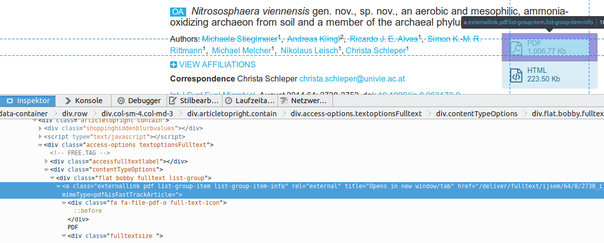

The download link for the PDF can be found in an `a` tag with the `class=externallink pdf list-group-item list-group-item-info`, in the `href` attribute. We tell quickscrape to download the file behind the link and store it under the renamed `fulltext.pdf`. The naming convention of fulltext.pdf is important as it serves the [ctree](../ctree/ctree-overview.md)-structure.

```
    "fulltext_pdf": {
      "selector": "//a[@class='externallink pdf list-group-item list-group-item-info']",
      "attribute": "href",
      "download": {
        "rename": "fulltext.pdf"
      }
```

For the HTML the procedure is similar:

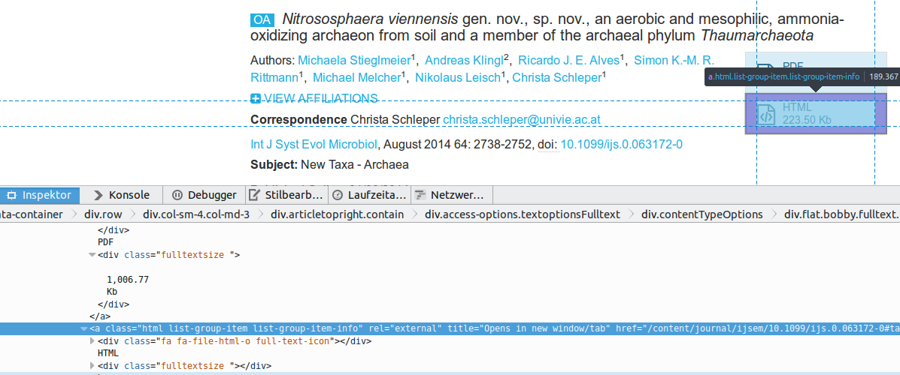

The download link can be found in an `a` tag with the `class=html list-group-item list-group-item-info`, in the `href` attribute. We tell quickscrape to download the file behind the link and store it under the renamed `fulltext.html`. Here as well the naming convention of fulltext.html is important as it serves the [ctree](../ctree/ctree-overview)-structure and is an input for [norma](../norma/norma-tutorial.md)

```
    "fulltext_html": {
      "selector": "//a[@class='html list-group-item list-group-item-info']",
      "attribute": "href",
      "download": {
        "rename": "fulltext.html"
      }
```

It get's a bit tricky with the supplementary material in this case, since it is stored in the same tag, class and attribute as the fulltext.pdf. But we know it is on the Supplementary Data-tab.

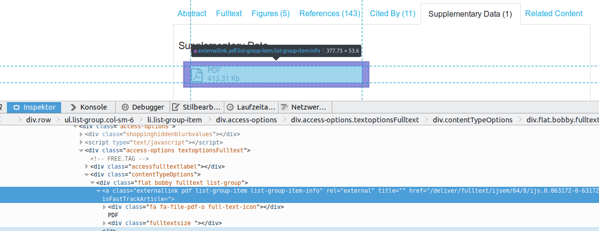

We therefore tell quickscrape to first follow the `suppdata_expansion` we defined earlier, and then look for the tag and attributes. There is no naming convention for supplementary material, so we tell quickscrape to download it without renaming.

```
    "supplementary_material": {
      "follow": "suppdata_expansion",
      "selector": "//a[@rel='externallink pdf list-group-item list-group-item-info']",
      "attribute": "href",
      "download": true
    }
```

Downloadable figures are behind the `Click to view` button. We click on it and inspect the image, which reveals that we can reach it through the `div` tag with `class='modal-body'`, and then navigate two tags further to `div/img`, where we tell quickscrape to take the `src`-attribute and download it.

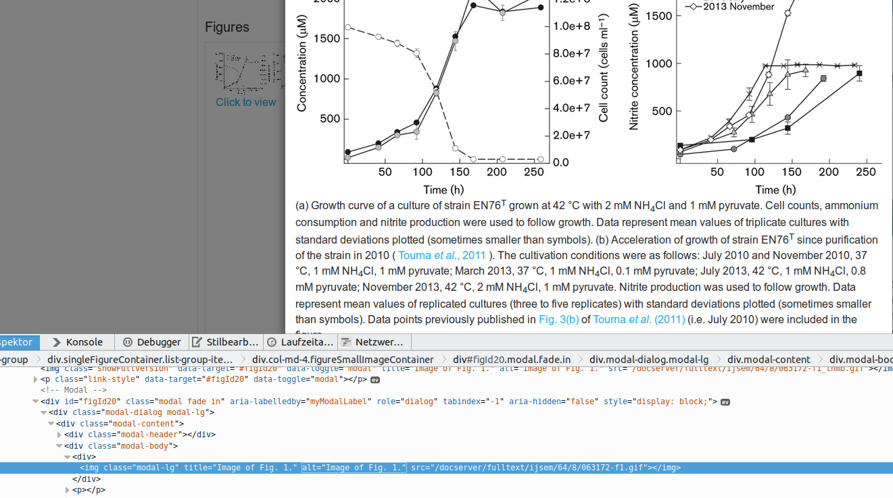


```
    "figure": {
      "follow": "figure_expansion",
      "selector": "//div[@class='modal-body']/div/img",
      "attribute": "src",
      "download": true
    },
    "figure_caption": {
      "follow": "figure_expansion",
      "selector": "//div[@class='col-md-8 figureCaptionContainer']",
      "attribute": "text"
    }
```

#### Fulltext

Now that we have the downloadable material, we want to scrape the fulltext, and ideally grab the structure of it as well, so we try to separate abstract, introduction, methods, results, discussion and conclusion. Author contributions and competing interests are of interest as well. 


```
    "introduction_text": {
      "follow": "fulltext_expansion",
      "selector": "//div[@class='articleSection' and div[@class='articleSection']/div/div/a[@name='introduction-1']]//*",
      "attribute": "text"
    }
```

In this selector we make use of the boolean operator `and` which combines two conditions. Through this we can separate the different section, which have the same class attribute `articleSection` and differ through the `name` attribute which is within an `a` three `div`s further down the tree. This looks like quite a leap of faith in this case. Please compare the different sections and it is very likely you come up with another, alternative query here.

```
    "methods_text": {
      "follow": "fulltext_expansion",
      "selector": "//div[@class='articleSection' and div[@class='articleSection']/div/div/a[@name='methods-1']]//*",
      "attribute": "text"
    },
    "results_text": {
      "follow": "fulltext_expansion",
      "selector": "//div[@class='articleSection' and div[@class='articleSection']/div/div/a[@name='resultsanddiscussion-1']]//*",
      "attribute": "text"
    },
    "acknowledgements_text": {
      "follow": "fulltext_expansion",
      "selector": "//div[@class='articleSection' and div[@class='articleSection']/div/div/a[@name='acknowledgement-1']]//*",
      "attribute": "text"
    }
```

We finally add copyright and licensing information:

```
    "license": {
      "selector": "//li//a[contains(@href, 'license')]",
      "attribute": "text"
      },
    "copyright": {
      "selector": "//p[contains(., 'copyright') or contains(., '©')]",
      "attribute": "text"
      }
```

The final scraper can be found [in the repository](https://github.com/ContentMine/journal-scrapers/blob/master/scrapers/ijsem.json).

### Contribution workflow

If you want to share your scraper definition with the world - that would be great! - you can do this via [GitHub](https://github.com/). You just need an account there and either a commandline or GUI-installation of Git, the steps afterwards are straighforward.

Go to the [ContentMine-scrapers repository](https://github.com/ContentMine/journal-scrapers) and make a fork.

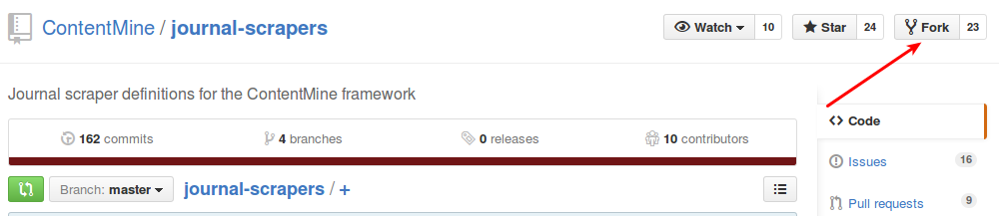

Then you switch to your fork of the repository which can be found under `https://github.com/**your_username**/journal-scrapers`. Copy the URL, open a commandline and clone the repository to a working directory with `git clone https://github.com/**your_username**/journal-scrapers`. 

You can now edit existing scraper definitions or add you own. The repository has the following structure: Scraper definitions go into the `scrapers`-folder, and testing material (a list of 5-10 urls where the scraper works, 1 per line) go into `test`.

```
.
├── README.md
├── scrapers
│   ├── acs.json
... ...
│   ├── elife.json
│   ├── ijsem.json.json
... ...
├── scripts
│   └── make_tests.rb
└── test
    ├── elife.json
    ├── elife_test_urls.txt
    ├── ijsem.json
    ├── ijsem-testurls.txt
    ...
    └── test_all.rb
```


Journal pages are a moving target, and publishers change formats from time to time. In order to keep our scrapers up-to-date, we have developed a testing routine which should be performed for each scraper. Please follow the [testing instructions](https://github.com/ContentMine/journal-scrapers/wiki/Generating%20tests%20for%20your%20scrapers).

Now you're ready for the big moment! In the commandline, type `git status` in your repo-folder, which should give you an output similar to this:
```bash
name@computer ~/journal-scrapers (git)-[ijsem] % git status                 
...
  changed:               scrapers/ijsem.json
  changed:               test/ijsem-testurls.txt
  changed:               test/ijsem.json
...
```
Add the three files to the next commit by `git add scrapers/ijsem.json`, `git add test/ijsem-testurls.txt` and `git add test/ijsem.json`.

Then commit your files together with a short explanation what you changed by e.g. `git commit -m 'ijsem definition and test added'`. This collects all your changes in one package and prepares it for merging with the existing scrapers.

Now push your commit from the local machine to the GitHub repository with `git push origin master` (may require your username and password).

On the GitHub-page of your repository, create a pull request:

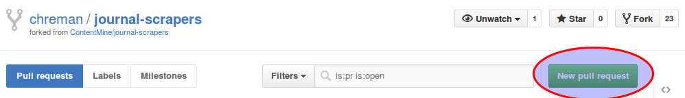

The next page shows you a comparison between our repository and your repository. Depending on how many changes have been made since your fork, a few differences will show up. Unless other people have worked on the same scraper, there should not be any problems with the pull request. Don't be afraid to make changes! Other people will have a look and try to detect errors, and if something breaks changes can be reverted easily.

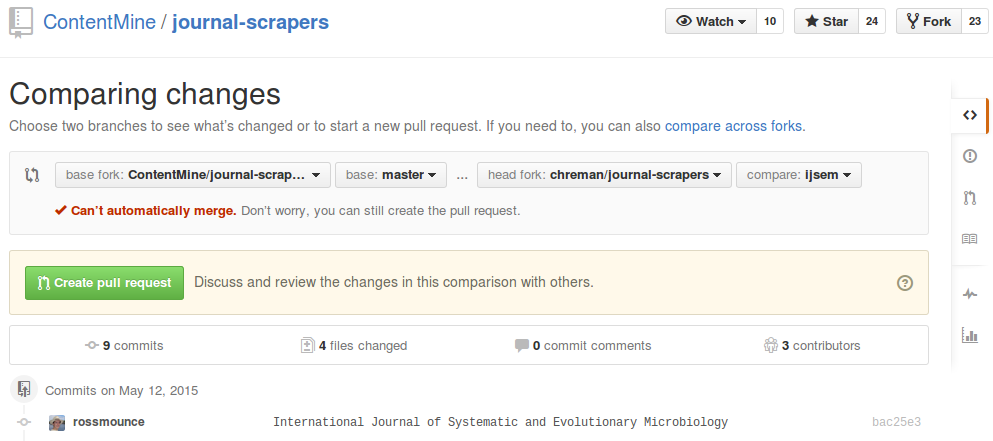

Click on `Create pull request`, add a title and a short description of what you changed, and then `Create pull request`.


### Receive Kudos

Exactly that.