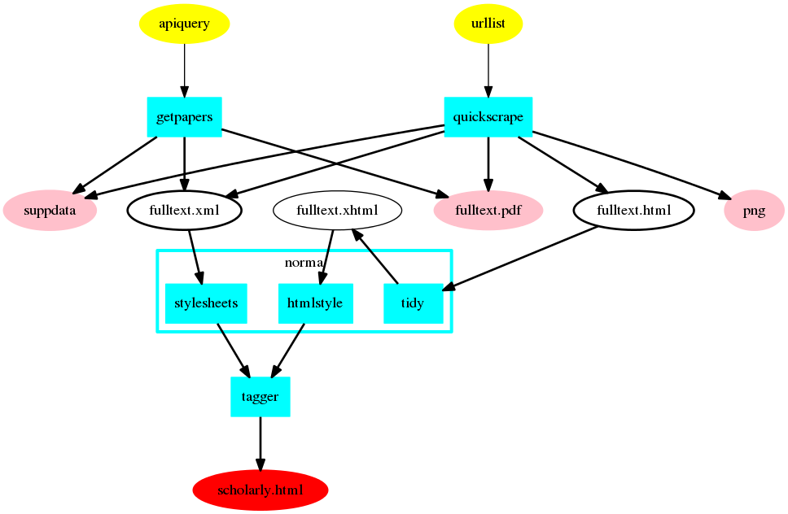
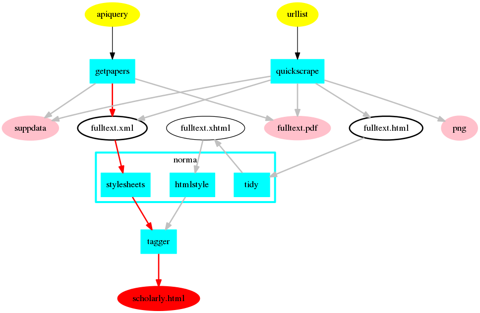
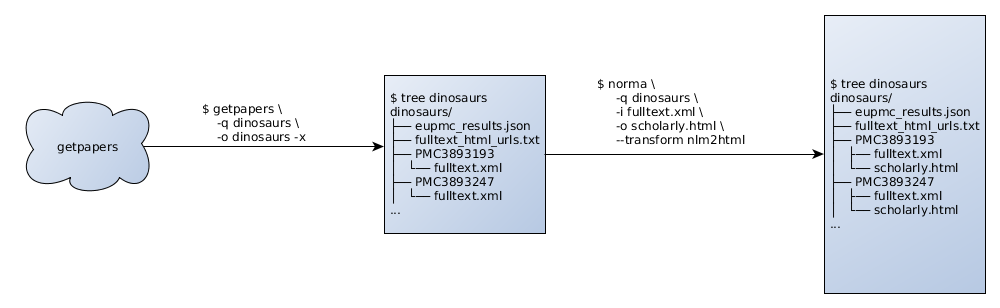
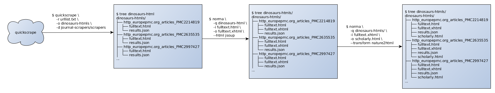
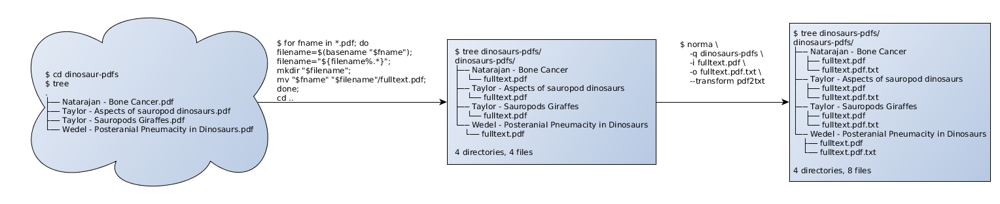

# norma
==============================

**Table of Content**
1. [Description](#description)

1. [Preparations](#preparations)

1. [Used Data](#used-data)

1. [XML to sHTML](#xml-to-shtml)

1. [HTML to sHTML](#html-to-shtml)

1. [PDF collections to TXT](#pdf-collections-to-txt)

1. [Summary](#summary)

1. [Next Tutorial](#next-tutorial)

1. [Further Materials](#further-materials)

## Description

**What norma does**

Norma helps to normalize the data coming from different sources into the unified, consistend data structure. For publicaions coming from [quickscrape](../qucikscrape/) and for publications coming from [getpapers](../getpapers/) as XML it transform the content into [scholarly HTML](../sHTML/) (sHTML). Norma furthermore possesses the ability to reverse engineer graphs, and e.g. extract data points from a timeline.

**Why do we need norma?**

Norma does all the unfunny stuff of taking all kinds of different file formats as PDF, XML and HTML from different publishing websites and API's with different layouts and taggings and combines it to our internal standard for scientific literature sHTML. So it takes all the hard work of parsing and merging together all the pieces, and offers an output, which can then be easily used for further processing.

**How can I use norma?**

Norma offers a web of paths between three different input streams (an API-query from [getpapers](../getpapers/getpapers-tutorial.md), a URL-scrape from [quickscrape](../quickscrape-tutorial.md), and an existing collection of PDFs)

**What you will learn here**

This tutorial shows you how to
* normalize results from getpapers towards sHTML
* normalize results from quickscrape towards sHTML
* and normalize a collection of PDFs towards simple text files

**How to use the tutorial**

We have some conventions at work, which will be used through-out the tutorial. 
- Variables as placeholders are always caps, like NAME, YOURDIRECTORY etc.

**Glossary**
- API
- PDF
- XML
- HTML
- Normalizing
- Parsing
- Scraping


## Preparations
### Prerequisites

### Used Software
- [Future TDM Virtual Machine](LINK)
- norma 0.1.4

### Installation

Norma can be installed from the latest `.deb`-file, [Download here](https://jenkins.ch.cam.ac.uk/view/AMI2/job/norma/org.xml-cml$norma/lastSuccessfulBuild/artifact/org.xml-cml/norma/0.1-SNAPSHOT/norma-0.1-SNAPSHOT.deb)

Get the file via terminal:
```bash
wget https://jenkins.ch.cam.ac.uk/view/AMI2/job/norma/org.xml-cml$norma/lastSuccessfulBuild/artifact/org.xml-cml/norma/0.1-SNAPSHOT/norma-0.1-SNAPSHOT.deb
sudo dpkg -i norma-0.1-SNAPSHOT.deb
```

The password is password.

You can find the technical documentation for `norma` in its [repository](https://github.com/ContentMine/norma).

## Data used



Norma can take 4 different file formats for the publications (XML, PDF, HTML, XHTML) and additional files for supplementary materials and PNG's. Most likely the data comes as output from getpapers or quickscrape, but you also can use your own PDF's or HTML.


## XML to sHTML



**Overview**




We start with a search results with getpapers

```bash
getpapers -q dinosaurs -o dinosaurs-xmls -x
```


getpapers returns a **project folder** containing search metadata and [ctrees](../ctree). Each ctree holds all data regarding one paper, in this case a `fulltext.xml`.

```
tree dinosaurs-xmls
dinosaurs-xmls/
├── eupmc_results.json
├── fulltext_html_urls.txt
├── PMC3893193
│   └── fulltext.xml
├── PMC3893247
│   └── fulltext.xml
...
```

We transform the fulltext.xml-files into sHTML. This can be done in bulk by passing the project folder with `-q`. The input/output-parameters `-i` and `-o` are verbose at the moment, we are working on simplifying to command, so that only the transformation parameter `--transform nlm2html` is needed. It is possible that norma prints a lot of debugging information, this does not automatically mean that something is wrong.

```bash
norma \
     -q dinosaurs-xmls \
     -i fulltext.xml \
     -o scholarly.html \
     --transform nlm2html
```

If you get an error that reads like this
```
270  [main] WARN  org.xmlcml.cmine.args.DefaultArgProcessor  - Recursing CMDIRs is probably  a BUG
270  [main] DEBUG org.xmlcml.cmine.args.DefaultArgProcessor  - ... No reserved files or directories: dir: dinosaurs-xmls/PMC3390907
```
it relates to an error that arises with empty folders created by quickscrape (see [issue 8](https://github.com/ContentMine/workshop-resources/issues/8)). To solve it temporarily, perform the following steps, which will delete the empty folders and keeps the ones with files:

```bash
cd dinosaurs-xmls
find -empty -delete
cd ..
```
After that, re-run the norma-commands. If a `scholarly.html`-file has been added to each ctree, norma was succesful.

```bash
tree dinosaurs-xmls
dinosaurs-xmls/
├── eupmc_results.json
├── fulltext_html_urls.txt
├── PMC3893193
│   ├── fulltext.xml
│   └── scholarly.html
├── PMC3893247
│   ├── fulltext.xml
│   └── scholarly.html
...
```

## HTML to sHTML


**Overview**



The path from a fulltext.html to a scholarly.html is a few steps longer. We begin with the results of quickscrape -> a list of fulltext-urls (this has to be provided by you).

```bash
quickscrape \
    -r urllist.txt \
    -o dinosaurs-htmls \
    -d journal-scrapers/scrapers
```

getpapers creates a project folder again containing ctrees. The metadata files are now within each ctree.
```bash
tree dinosaurs-htmls
dinosaurs-htmls/
├── http_europepmc.org_articles_PMC2214819
│   ├── fulltext.html
│   └── results.json
├── http_europepmc.org_articles_PMC2635535
│   ├── fulltext.html
│   └── results.json
├── http_europepmc.org_articles_PMC2997427
│   ├── fulltext.html
│   └── results.json
...
```

We first need to tidy up the `fulltext.html`-files, since not all html-files may be *well-formed* in the sense of conforming to the [W3C-standard](http://www.w3.org/TR/html5/). This is necessary for documents to be parseable. There are some tools that try to ensure well-formedness of a document. For this we pass the project folder with `-q`, specify input and output files with `-i` and `-o` and use `--html jsoup` for cleaning up the html.
```bash
norma \
    -q dinosaurs-htmls \
    -i fulltext.html \
    -o fulltext.xhtml \
    --html jsoup
```

This procedure creates an intermediary document `fulltext.xhtml`. 
```bash
tree dinosaurs-htmls/
dinosaurs-htmls/
├── http_europepmc.org_articles_PMC2214819
│   ├── fulltext.html
│   ├── fulltext.xhtml
│   └── results.json
├── http_europepmc.org_articles_PMC2635535
│   ├── fulltext.html
│   ├── fulltext.xhtml
│   └── results.json
├── http_europepmc.org_articles_PMC2997427
│   ├── fulltext.html
│   ├── fulltext.xhtml
│   └── results.json
...
```

The final step removes content we do not want or need, such as publisher's related material, or social media feeds. This requires specific html-styles for each publisher, at the moment only one is available for testing purposes.
```bash
norma \
    -q dinosaurs-htmls/ \
    -i fulltext.xhtml \
    -o scholarly.html \
    --transform nature2html
```

We then have a project folder with ctrees, that trace the path from `fulltext.html` to `scholarly.html`
```bash
tree dinosaurs-htmls/
dinosaurs-htmls/
├── http_europepmc.org_articles_PMC2214819
│   ├── fulltext.html
│   ├── fulltext.xhtml
│   ├── results.json
│   └── scholarly.html
├── http_europepmc.org_articles_PMC2635535
│   ├── fulltext.html
│   ├── fulltext.xhtml
│   ├── results.json
│   └── scholarly.html
├── http_europepmc.org_articles_PMC2997427
│   ├── fulltext.html
│   ├── fulltext.xhtml
│   ├── results.json
│   └── scholarly.html
...
```

## PDF collections to text

This is still in an experimental stage. It works, but the output is not very clean and not ready for further preprocessing. But if you want to extract the *raw content* of a PDF, this is possible here.

PDF is a notoriously bad format for automatic processing. While understandable for the human reader, PDF is a real obstacle for computers and so for content mining. This lies in the nature of the document, which - from a machine's perspective - is essentially a 2-dimensional plane with symbols on it. The only information that a machine readily knows about any symbol is it's x- and y-location on the plane. Meaning, relations with other symbols, or logical concepts are not present in a PDF and have to be constructed by input from the outside.


**Overview**



If you have an existing collection of PDFs, norma can apply some simple normalizations to them as well. Before that, we have to move them into a ctree-similar structure. If you change into your folder with PDFs (e.g. `cd dinosaur-pdfs`), you may find something like this:

```
cd dinosaur-pdfs
tree
.
├── Natarajan - Bone Cancer.pdf
├── Taylor - Aspects of sauropod dinosaurs.pdf
├── Taylor - Sauropods Giraffes.pdf
└── Wedel - Posteranial Pneumacity in Dinosaurs.pdf

0 directories, 4 files
```

You can then use the following small shell script to create folders based on the names of PDFs, move each PDF into the corresponding folder, and rename it to fulltext.pdf. Execute the script line by line in your terminal. 

```bash
for fname in *.pdf; do
filename=$(basename "$fname");
filename="${filename%.*}";
mkdir "$filename";
mv "$fname" "$filename"/fulltext.pdf;
done
```

This is now our project folder. We then move one level back in the hierarchy with `cd ..`, in order to run norma from outside the folder.

The folder structure should then look like this:

```
cd ..
tree dinosaur-pdfs
dinosaur-pdfs
├── Natarajan - Bone Cancer
│   └── fulltext.pdf
├── Taylor - Aspects of sauropod dinosaurs
│   └── fulltext.pdf
├── Taylor - Sauropods Giraffes
│   └── fulltext.pdf
└── Wedel - Posteranial Pneumacity in Dinosaurs
    └── fulltext.pdf

4 directories, 4 files
```

To finally convert the pdf into text files, it is just necessary to use one command.

```bash
norma -q dinosaurs-pdfs/ -i fulltext.pdf -o fulltext.pdf.txt --transform pdf2txt
tree dinosaurs-pdfs/
dinosaurs-pdfs/
├── Natarajan - Bone Cancer
│   ├── fulltext.pdf
│   └── fulltext.pdf.txt
├── Taylor - Aspects of sauropod dinosaurs
│   ├── fulltext.pdf
│   └── fulltext.pdf.txt
├── Taylor - Sauropods Giraffes
│   ├── fulltext.pdf
│   └── fulltext.pdf.txt
└── Wedel - Posteranial Pneumacity in Dinosaurs
    ├── fulltext.pdf
    └── fulltext.pdf.txt

4 directories, 8 files
```

## Summary

* use publications downloaded via getpapers and convert the XML to uniform sHTML
* use publications downloaded via quickscrape and convert the HTML to uniform sHTML
* convert PDF's to text files

## next tutorial
* Continue to [sHTML](../sHTML/sHTML-overview.md) if you want to learn more about scholarly HTML.
* Continue to [ami](../ami/ami-tutorial.md) for the next step of the ContentMine pipeline.

## Further material

**Slides**


**Assets**

**Videos**


**Learning Materials**

**www**


**Papers**


