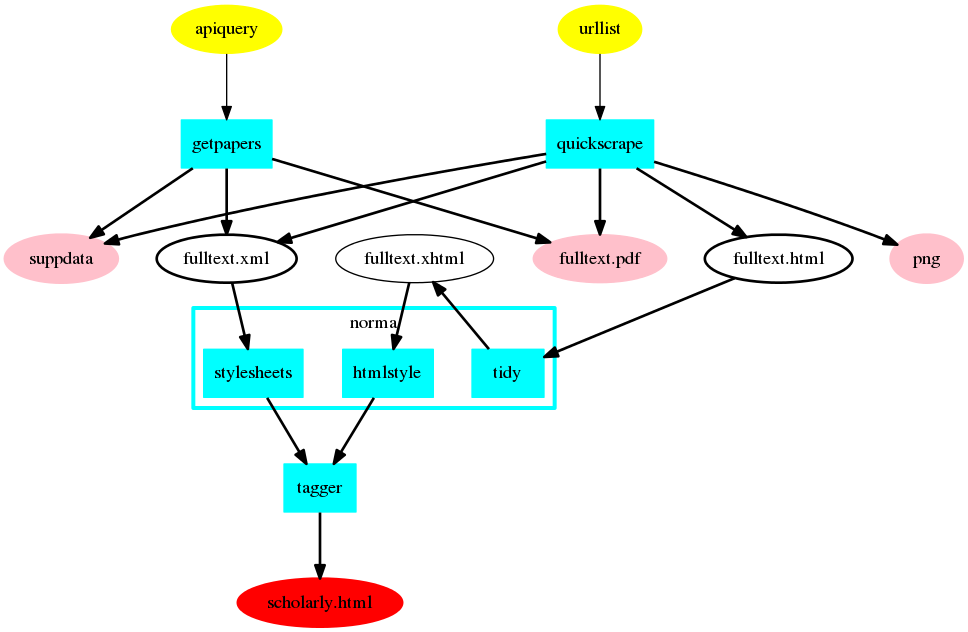
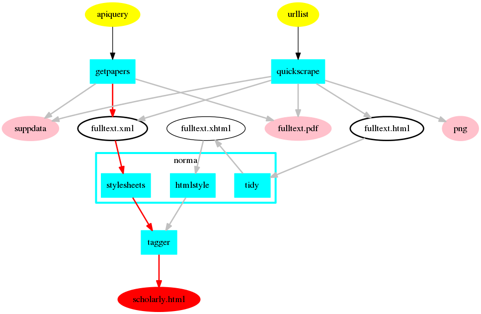
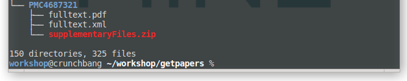
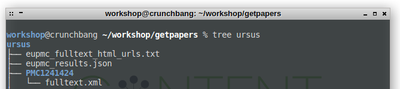
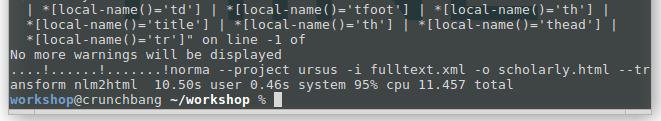
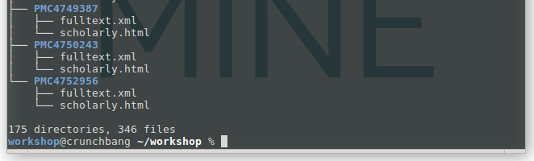

# norma
==============================

## Table of Content

1. [Description](#description)
1. [Preparations](#preparations)
1. [Data Used](#data-used)
1. [Tutorial](#tutorial)
	1. [XML to sHTML](#xml-to-shtml)
	1. [PDF collections to TXT](#pdf-to-txt)
1. [Troubleshooting](#troubleshooting)
1. [Summary](#summary)
1. [Next Tutorial](#next-tutorial)
1. [Further Materials](#further-materials)

## Description

**What norma does**

Norma transforms different file formats such as PDF, XML or HTML provided by publishing websites and API's into our internal standard for scientific literature called [scholarly HTML](../sHTML/). Norma furthermore possesses the ability to reverse engineer graphs, and e.g. extract data points from a timeline.

**Why do we need norma?**

 Norma parses and merges different formats and file standards of scientific literature, and offers a unified output which can be used for further processing. 

**How can I use norma?**

Norma offers paths from three different input streams to sHTML:
* from XML-files collected by an API-query of [getpapers](../getpapers/getpapers-tutorial.md)
* from HTML-files collected by a URL-scrape of [quickscrape](../quickscrape-tutorial.md)
* from an existing collection of PDFs

**What you will learn here**

This tutorial shows you how to
* normalize XML-files or HTML-files into sHTML
* normalize a collection of PDFs into simple text files

**How to use the tutorial**

We have some conventions at work, which will be used through-out the tutorial. 
- Variables as placeholders are always caps, like NAME, YOURDIRECTORY etc.

**Glossary**
- API
- PDF
- XML
- HTML
- Normalizing
- Parsing
- Scraping


## Preparations
### Prerequisites

### Used Software
- [Future TDM Virtual Machine](LINK)
- norma 0.1.4

### Installation

On the ContentMine-VM norma is already provided. If you want to install it locally or upgrade it in the VM, you can build it from source. For this you need `git`, `maven` and `maven3`.

```bash
git clone https://github.com/ContentMine/norma.git
cd norma
mvn clean install
```

You can find the technical documentation for `norma` in its [repository](https://github.com/ContentMine/norma).

## Data used



Norma can take 4 different file formats for the publications (XML, PDF, HTML, XHTML) and additional files for supplementary materials and PNG's. getpapers or quickscrape can be used to create a corpus of papers, but you also can use your own PDFs or HTML. The task is to unify the different input streams into a single data format.

## Tutorial

### XML to sHTML



We continue after retrieving a number of papers with `getpapers -q 'ursus maritimus' -o ursus -x`.

getpapers returns a [CProject](../cproject)-folder. It contains subfolders holding one paper and associated files, fulltexts in PDF or XML format, and if requested, supplementary files. Just a quick reminder of how it may look like:





We now transform the fulltext.xml-files into sHTML. This can be done in bulk by passing the project folder with `-q`. The input/output-parameters `-i` and `-o` are the files to read in and write to. The parameter `--transform nlm2html` corresponds to a specific transformation from one format to another.

```bash
norma --project ursus -i fulltext.xml -o scholarly.html --transform nlm2html
```



norma will print a lot process information in the form of format warnings.

If you inspect the folder with `tree ursus`, norma will have added a `scholarly.html`-file to those papers, where a format conversion was possible.



### PDF to text

PDF is a notoriously bad format for automatic processing. While understandable for the human reader, PDF is a real obstacle for computers and so for content mining. This lies in the nature of the document, which - from a machine's perspective - is essentially a 2-dimensional plane with symbols on it. The only information that a machine readily knows about any symbol is it's x- and y-location on the plane. Meaning, relations with other symbols, or logical concepts are not present in a PDF and have to be constructed by input from the outside.

This process is still in an experimental stage, and most suited if you have an application for plain text analysis and want to extract the *raw content* of a PDF.

Before we can apply norma on a collection of PDFs, we have to move them into a CProject structure. First place all target PDFs into a folder, and [cd](../shell) into it. You can then use the following code to create folders based on the names of PDFs, move each PDF into the corresponding folder, and rename it to fulltext.pdf.

```bash
for fname in *.pdf; do
filename=$(basename "$fname");
filename="${filename%.*}";
mkdir "$filename";
mv "$fname" "$filename"/fulltext.pdf;
done
```

This is now our CProject folder. We then move one level back in the hierarchy with `cd ..`, in order to run norma from outside the folder.

The folder structure should then look like this:

```
tree my-pdfs
my-pdfs
├── foldername1
│   └── fulltext.pdf
├── foldername2
│   └── fulltext.pdf
├── foldername3
│   └── fulltext.pdf
└── foldername4
    └── fulltext.pdf

4 directories, 4 files
```

To finally convert the pdf into text files, run the following norma-commands:

```bash
norma --project ursus/ -i fulltext.pdf -o fulltext.pdf.txt --transform pdf2txt
```

## Summary

* use publications downloaded via getpapers and convert the XML to uniform sHTML with `norma --project PROJECTFOLDER -i fulltext.xml -o scholarly.html --transform nlm2html`
* convert PDF's to text files with `norma --project PROJECTFOLDER -i fulltext.pdf -o fulltext.pdf.txt --transform pdf2txt`

## next tutorial
* Back to the [tutorial overview](..)
* Continue to [sHTML](../sHTML) if you want to learn more about scholarly HTML.
* Continue to [ami](../ami) for the next step of the ContentMine pipeline.

