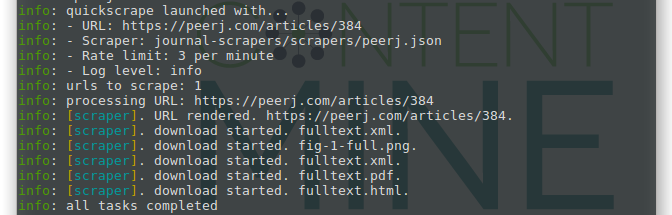

.png)

## What is quickscrape?

`quickscrape` is together with [getpapers](../getpapers/getpapers-tutorial.md) one of the entry points of the ContentMine pipeline. quickscrape is not like other scraping tools. It is designed to enable large-scale content mining, and retrieve PDFs, images and fulltext-htmls of scientific literature.

[1. Installation](#installation)

[2. Scraper definitions](#scraper-definitions)

[3. Scraping](#scraping)

[4. Summary and next steps](#summary-and-next-steps)


### Installation

```bash
$ npm install --global quickscrape
```

### Scraper definitions

**Quickscrape is not complete without the scraper definitions**. They are developed individually for each journal to accustom for different page layouts or html-tags. Scraper definitions are maintained in a [separate repository](https://github.com/ContentMine/journal-scrapers.git), and it is possible to [create your own definitions](../journal-scrapers/journal-scrapers-tutorial.md).

You can download the newest scraper definitions with this command:
```bash
git clone https://github.com/ContentMine/journal-scrapers.git
```
The scraper definitions will then be found in `your_path/journal-scraper/scrapers/`. You need to remember this path when using quickscrape. 

### Scraping

There are two possible inputs for quickscrape, a single url, or list of urls. The single url may be passed as a parameter from the command line, the list of urls may be curated either manually by you, or may be taken from a basic getpapers query. quickscrape will then visit every URL in this list and grab everything sensible it can. This includes sections according to tags, images, or tables, but depends heavily on the format that is provided by the publishers. At the moment there exist definitions for following publishers/journals:

* BMC
* PLoS
* PeerJ
* PNAS
* elife
* with more to come.

```bash
$ quickscrape -u url -s journal-scrapers/scrapers/scraper.json -o test_folder
```

The scraper you use should correspond the to URL you provide, e.g.

```bash
quickscrape \
  -u https://peerj.com/articles/384 \
  -s journal-scrapers/scrapers/peerj.json \
  -o peerj-384
```



```bash
$ tree peerj-384/
peerj-384/
└── https_peerj.com_articles_384
    ├── fig-1-full.png
    ├── fulltext.html
    ├── fulltext.pdf
    ├── fulltext.xml
    └── results.json

1 directory, 5 files
```

In the next example we take the output we get from a [basic getpapers query](../getpapers/getpapers-tutorial.md#construct-a-simple-query_and-compare-results), e.g. `getpapers -q 'dinosaurs' --api eupmc -o test_eupmc`. This returns two files in a search results folder. An *apiname*_results.json, which contains metadata about the search results, and a fulltext_html_urls.txt, which contains a list of URLs of fulltext papers.

```bash
$ tree test_eupmc
test_eupmc
├── eupmc_results.json
└── fulltext_html_urls.txt
```

We now take the fulltext_html_urls.txt as input for quickscrape. quickscrape will choose a scraper automatically, if one is available. If not, a scraper with very generic definitions will be used, and the result will not be as precise.

```bash
$ quickscrape -r test_eupmc/fulltext_html_urls.txt -d journal-scrapers/scrapers/ -o test_eupmc
```

Quickscrape now creates a subfolder for each searchresult, describing the article source, a fulltext.html with the scraping results, and a results.json containing metadata of the article, e.g. authors, title, abstract and bibliographic data. It may include other files such as fulltext PDFs, fulltext XMLs, or scraped images.
```bash
$ tree test_eupmc
test_eupmc
├── eupmc_results.json
├── fulltext_html_urls.txt
├── http_europepmc.org_articles_PMC1234567
│   ├── fulltext.html
│   └── results.json
├── http_europepmc.org_articles_PMC1234568
│   ├── fig-1-full.png
│   ├── fig-2-full.png
│   ├── fulltext.html
│   ├── fulltext.pdf
│   ├── fulltext.xml
│   └── results.json
├── ...
...
└── http_europepmc.org_articles_PMC4448809
    ├── fulltext.html
    ├── fulltext.pdf
    └── results.json

19 directories, 43 files

```

This is one of the starting points for a [ctree](../ctree-introduction.md), the main datastructure of the ContentMine pipeline.


## Summary and next steps

* A minimum query consists of a URL (or URL-list) and the path to a specific scraper (or a folder containing scraper definitions).
* Please be a respectful and responsible miner and apply a reasonable rate limit `-r` (recommended between 3 and 6).
* The result will be a collection of folders, containing 

**Next steps**
* Continue to [journal-scrapers](../journal-scrapers/journal-scrapers-tutorial.md) if you want to define your own scraper.
* Continue to [norma](../norma/norma-tutorial.md) for the next step of the ContentMine pipeline.
* Continue to [ctree](../ctree/ctree-overview.md) for an introduction of the main datastructure.