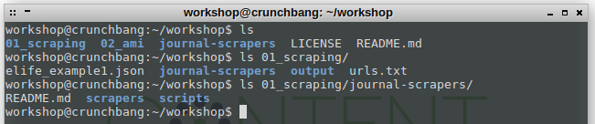
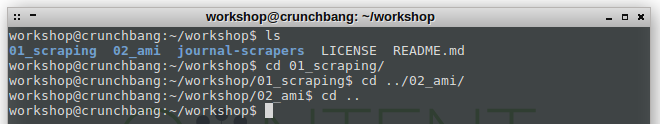
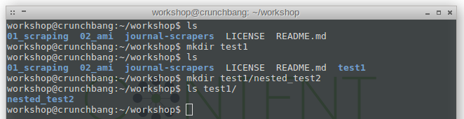
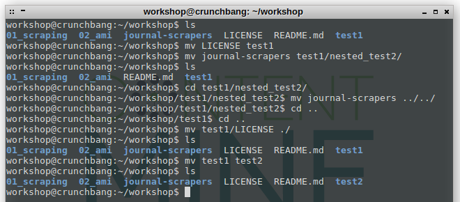
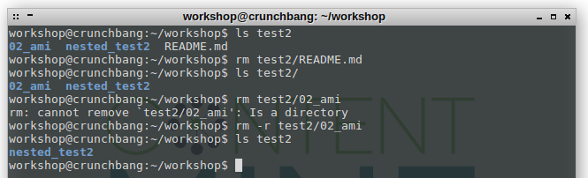

.png)

### Basic shell commands

In general: autocompletion with 'tab' may save you a lot of typing.

If you want to interrupt and cancel the execution of a command, just press ```CTRL``` + ```c```.

**ls**: **l**i**s**ts files and directories, takes the current working directory as root. You can also look into the content of nested directories by simply extending the path ```ls dir/nested_dir/nested_dir2```.



**tree**: The tree-command provides a hierarchical overview of a folders content, including subfolders.

**cd**: **c**hange **d**irectory, moves the working directory location to the target location. You can move laterally between folders on the same level with ```cd ../new_location```. You can also move up in the directory hierarchy with ```cd ..```. If you want to navigate to an absolute path, you have to start with a slash "/", ```cd /home/workshop/workshop/absolute_path```.



**mkdir**: **m**a**k**e **dir**ectory: creates a new directory



**mv**: **m**o**v**es files and directories from the first location to the second. You can move them further down into already existing directories, but also up with ```mv dir ../higher_dir```, and into the current directory with ```mv lower_dir ./new_lower_dir```.

mv is also used to rename files or folders, e.g. ```mv old_filename.txt new_filename.txt```.



**cp**: **c**o**p**ies files from the first location to the second. If you want to copy a folder, you have to use ```cp -r source_dir target_dir``` where ```-r``` stands for recursive.


**rm**: **r**e**m**oves the specified file. If you want to remove a directory, use ```rm -r dir``` but make sure you want this.




´´´
# prints the whole file to the terminal
cat test_eupmc/fulltext_html_urls.txt
# prints the top 10 lines
head test_eupmc/fulltext_html_urls.txt
# prints the last 5 lines
tail -5 test_eupmc/fulltext_html_urls.txt
wc -l test_eupmc/fulltext_html_urls.txt
grep dinosaur test_eupmc/eupmc_results.json
grep -A1 abstractText test_eupmc/eupmc_results.json

´´´


 !!!
