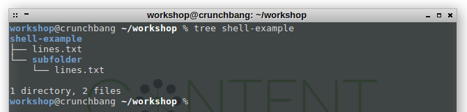
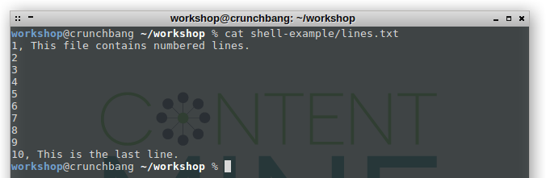
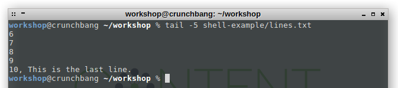

.png)

### Basic shell commands

In general: autocompletion with 'tab' may save you a lot of typing. If you want to interrupt and cancel the execution of a command, press ```CTRL``` + ```c```.

**ls**: **l**i**s**ts files and directories, taking the current working directory as starting point. You can also look into the content of subdirectories by extending the path ```ls dir/nested_dir/nested_dir2``` ([wikipedia](https://en.wikipedia.org/wiki/Ls). We inspect which files and folders are present in our current working directory and in the `shell-example` folder:
```
ls
ls shell-example
```


**tree**: The tree-command provides a hierarchical overview of a folders content, including subfolders. Please note that if you work on your local machine and not within our virtual machine, you may have to [install tree first](https://askubuntu.com/questions/431251/how-to-print-the-directory-tree-in-terminal).
```
tree shell-example
```



**cd**: **c**hange **d**irectory, moves the working directory location to the target location. You can move back up in the directory hierarchy with `cd ..`. If you want to navigate to an absolute path, you have to start with a "/", `cd /home/workshop/workshop/`.
```
cd shell-example
ls
cd ..
```


**mkdir**: **m**a**k**e **dir**ectory: creates a new directory ([wikipedia](https://en.wikipedia.org/wiki/Cd_(command))).
```
mkdir new-folder
ls
```


**mv**: **m**o**v**es files and directories from the first location to the second. You can move them further down into already existing directories, but also up with ```mv dir ..```, and into the current directory with ```mv lower_dir ./new_lower_dir``` ([wikipedia](https://en.wikipedia.org/wiki/Mkdir)). mv is also used to rename files or folders, e.g. ```mv old_filename.txt new_filename.txt```.
```
mv new-folder shell-example
ls shell-example
mv shell-example/new-folder ./
ls
```


**cp**: **c**o**p**ies files from the first location to the second ([wikipedia](https://en.wikipedia.org/wiki/Cp_(Unix))). If you want to copy a folder, you have to use ```cp -r source_dir target_dir``` where ```-r``` stands for recursive.
```
cp -r shell-example shell-example-2
ls
tree shell-example
tree shell-example-2
```


**rm**: **r**e**m**oves the specified file ([wikipedia](https://en.wikipedia.org/wiki/Rm_(Unix))). If you want to remove a directory, use ```rm -r dir``` but be sure you want this.
```
rm -r shell-example-2
ls
```


**cat**: **cat**enates the content of a file sequentially and prints line by line to the terminal ([wikipedia](https://en.wikipedia.org/wiki/Cat_%28Unix%29))
```
cat shell-example/lines.txt
```



**head**: prints the first *n* lines to the terminal ([wikipedia](https://en.wikipedia.org/wiki/Head_(Unix))). Default is 10.
```
head -5 shell-example/lines.txt
```


**tail**: prints the last *n* lines to the terminal ([wikipedia](https://en.wikipedia.org/wiki/Tail_(Unix))). Default is 10.
```
tail -5 shell-example/lines.txt
```



**wc**: Counts different things in a file, e.g. words, lines, or bytes ([wikipedia](https://en.wikipedia.org/wiki/Wc_%28Unix%29)). **wc -l filename** counts lines.
```
wc -l shell-example/lines.txt
wc -w shell-example/lines.txt
```


* [Return to tutorial overview](..)
* [Proceed to getpapers-tutorial](../getpapers)