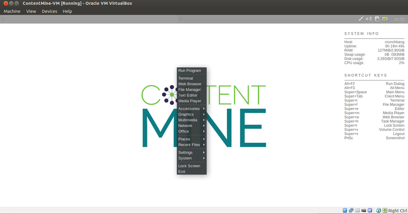

# ContentMine virtual machines

## What is it, and how do you use it?

A virtual machine is a simulated operating system 'within' your operating system (think Inception for operating systems). In our case it is a Linux-based [Debian distribution](https://www.debian.org/). The user interface may appear quite different on the first view, and we provide information how to navigate and use it [here](# Working in the ContentMine virtual machine).

We use virtual machines (VMs) in order to carry out hands-on exercises using the ContentMine software. This allows all attendees to run the software without having to modify their own systems. The ContentMine tool chain requires external software and third party tools, the setup of which is not trivial on some operating systems and takes time and effort (e.g. node.js, the right java version, latex2html,...). We therefore offer the virtual machine as a **pre-configured environment**, which can be guaranteed to work. This allows us to quickly and smoothly get content mining, with a mininum of fuss.

## Installation Instructions
.png)

# The ContentMine virtual machine

Before the workshop, all attendees should do the following (instructions below):

1. Download and install the VirtualBox
2. Download and install the ContentMine virtual machine image
3. Try booting-up the virtual machine and test your keyboard mapping in a text editor

### 1. Getting VirtualBox

Please download the VirtualBox platform installer for your operating system from the [VirtualBox website](https://www.virtualbox.org/wiki/Downloads).

Run the installer and follow the on-screen instructions.

### 2. Getting the ContentMine VM image

Requirements:
* 64-bit architecture (unless otherwise stated)
* 3 GB RAM
* Adequate hard drive space for the VM (at least 5 GB)

Please download from the `link` for the virtual image corresponding to the relevant workshop from the list below. This should be an `.ova` file. Note, this is a large file >1GB, please be patient while it downloads. Depending on your connection that can take between 10 and 60 minutes (or much longer if you have very slow connection).

When the file has downloaded, double-clicking it should open VirtualBox and offer to import the virtual machine. Please follow the on-screen instructions to complete the import.

### Troubleshooting

If you have any problems getting VirtualBox, or downloading and importing the virtual image, don't worry. Just contact the workshop organizer before the event and we can help you via email or skype. **Please, please try and get these pre-workshop tasks done _before_ arriving at the workshop. There will be little time on the day to help with Virtualbox issues**.

The most common error is an incomplete download of the large VM image file, please verify that the download has been succesfully and _fully_ completed.

### List of available machines

This is a list of ContentMine virtual machines, with descriptions, in reverse date order (i.e. most recent first).

1. 'Biology' VM for University of Bath workshop [28/07/15] [link](https://onedrive.live.com/redir?resid=1652077CF1AA4E9F!1280&authkey=!AGyzu9zuzzKeJok&ithint=file%2cova)
2. 'Neuro' VM for Edinburgh Neuroscience hack [26/05/15] - [direct link](https://www.dropbox.com/s/yes9af47fn8vnz7/ContentMine-VM.ova?dl=0)
3. 'Cochrane' VM for Oxford Cochrane centre workshop [2015/03/15] - [direct link](https://drive.google.com/file/d/0B6ChGXuXmOEDemRtb1JBakREYWc/view?usp=sharing)
4. 'Playground' VM for [EBI workshop](https://github.com/ContentMine/EBI_workshop_20150330) [2015/03/30] - [direct link](https://drive.google.com/uc?export=download&confirm=dp8f&id=0B6ChGXuXmOEDNWx2d0EwbDkyY00) - [installation instructions](https://github.com/ContentMine/EBI_workshop_20150330/blob/master/docs/pre-workshop_installation.pdf)


.png)


## Working in the ContentMine virtual machine

[1. Starting](# 1. Starting)

[2. Usage](# 2. Usage)

[3. Basic Commands](# 3. Basic Commands)

### 1. Starting

After installing the vm ([see here](# Installation Instructions)), you can start the machine from the VirtualBox interface. Choose the image called ContentMine-VM and click the "Start" button.


After a few seconds you land on the desktop.



You can shut down the vm by right click and then "Exit", and "Power off".

### 2. Usage

Everything starts with a right click from here. If you want to visually navigate through the folders on the machine, right-click on the desktop and select "File Manager". There is also a browser included, which can be opened with right-click and "Web Browser".
The ContentMine pipeline is controlled from the **command line interface**, which can be opened with right-click and "Terminal". This opens a text-based interface, from where we can navigate folders, look into files, and interact with the ContentMine software.


You can maximize it to fullscreen by double clicking on the title bar.

#### Copy & Paste

The settings of the vm allows to share the clipboard with the host machine. That means you can copy a url from the host machine's browser and paste it into the vm's browser, and vice versa. That works also with e.g. longer text and between text editors.

If you want to paste something into the command line, this is possible with right-click+"Paste", or ```Ctrl+Shift+V```. If you want to copy something out of the command line, e.g. an error message, highlight the message with the cursor, and then either right-click+"Copy" or use ```Ctrl+Shift+C```.

#### File import/export between the host system and the vm

If you want to transfer files between the host system and the vm, you have to set up a shared folder. This has to be done in the VirtualBox before starting the vm. Go to "Settings-Shared Folders"


#### Troubleshooting

If you run into issues with your keyboard layout, open a terminal window and set the layout to your locale, e.g. uk/us/de
```
setxkbmap us
```

The command line is going to be the main interface with ContentMine. Some basic commands for using and navigating the command line are documented [here](../shell/shell-tutorial.md), please have a look if you are new to using the command line.