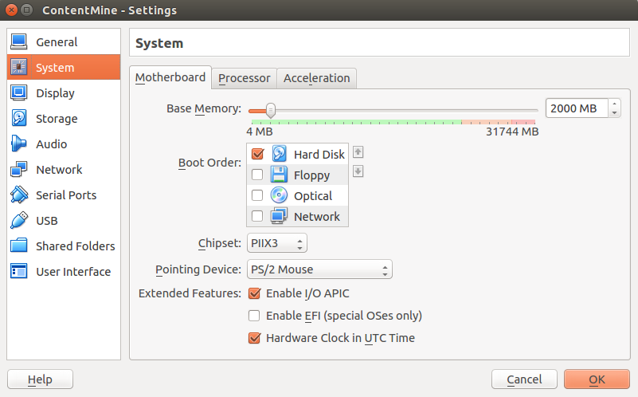
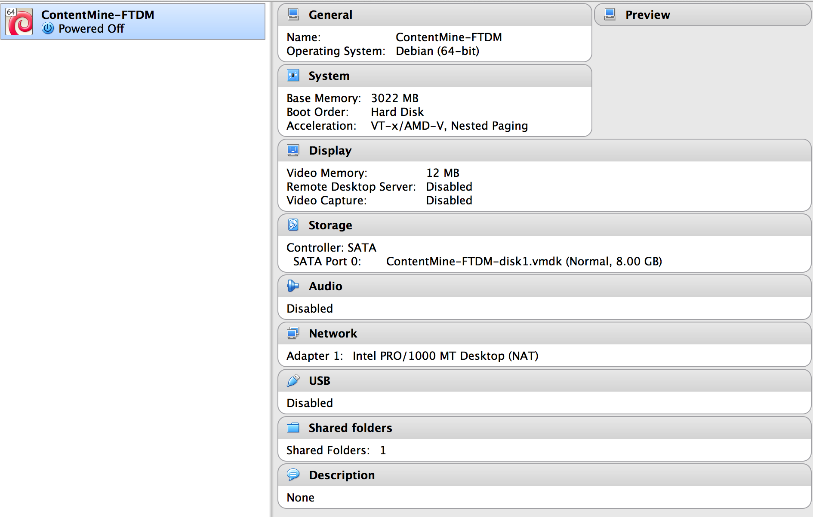
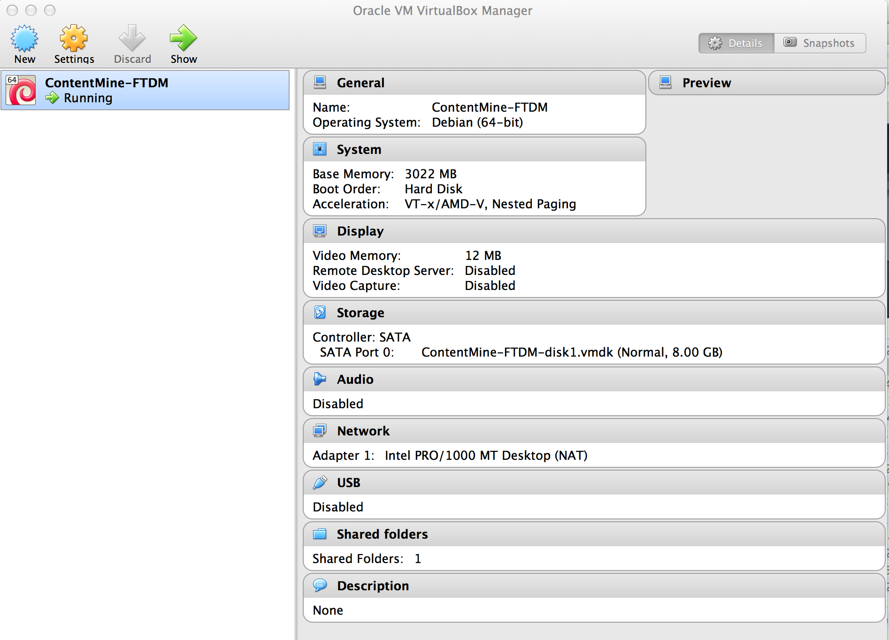
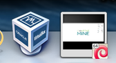
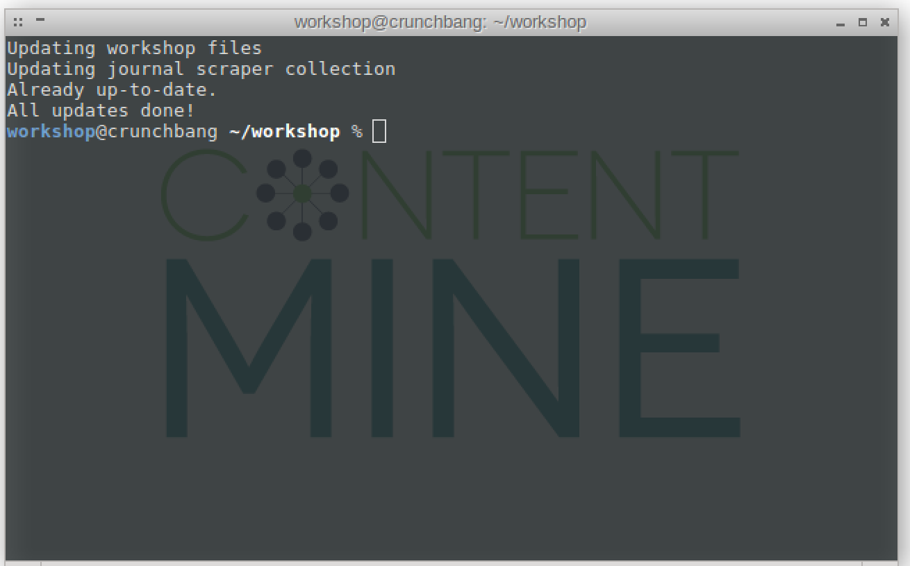

# ContentMine Virtual Machines

## Table of Contents

1. [Description](#description)
2. [Installation](#installation)
3. [Troubleshooting](#troubleshooting)
4. [Components](#components)

## DESCRIPTION

**What is a virtual machine?**
A virtual machine is a simulated operating system 'within' your operating system (think Inception for operating systems). It consists of two parts:
* [VirtualBox](https://www.virtualbox.org/): the software which runs the virtual machine
* [ContentMine virtual machine image](): an image in which the whole operating system with its configuration and our ContentMine software packages are located

**Why does ContentMine use a virtual machine?**
Virtual Machines make it easy to use pre-configured software environments on different operating systems. In our case, it allows us to run the ContentMine software easily on all kinds of operating systems (Linux, Windows and Mac). This is used mostly for hands-on workshops and allows all attendees to run the software without having to modify their own systems. This allows us to quickly and smoothly start content mining, with a mininum of fuss.

**How can I use the virtual machine?**
For this, you have to install [VirtualBox](https://www.virtualbox.org/) and start from it the [ContentMine virtual machine image](). You will find more details in the install section.

## INSTALLATION

### Install VirtualBox
VirtualBox runs on Windows, Linux, Macintosh, and Solaris and licensed under GNU General Public License (GPL) version 2.

**Requirements**
* Reasonably powerful x86 hardware. Any recent Intel or AMD processor should do.
All the other things depend on the requirements of the virtual machine image, as you can find them below.

1. Download the VirtualBox platform installer for your operating system from the [VirtualBox website](https://www.virtualbox.org/wiki/Downloads).
2. Run the installer and follow the on-screen instructions.

### Installing the ContentMine Virtual Machine image

**Requirements**
* 64-bit architecture (unless otherwise stated)
* 3 GB RAM
* Adequate hard drive space for the VM (at least 5 GB)

1. Download the required ContentMine virtual machine image
	* 'Current VM' as at [May 2016](https://drive.google.com/open?id=0B7pJKedx9b97LTBVRmEzbzJOVlU)
		* getpapers v0.4.5
		* quickscrape v0.4.7
		* norma v0.2.26
		* ami v0.2.24
	* 'Contentmine-FTDM' VM for Cambridge workshop/s [2015-12-10/11](http://contentmine.org/wp-content/uploads/static/contentmine-VM.ova) (3534356480 bytes on MAC-OSX)
	* 'Biology' VM for University of Bath workshop [28/07/15](https://onedrive.live.com/redir?resid=1652077CF1AA4E9F!1280&authkey=!AGyzu9zuzzKeJok&ithint=file%2cova)
	* 'Neuro' VM for Edinburgh Neuroscience hack [26/05/15] - [direct link](https://www.dropbox.com/s/yes9af47fn8vnz7/ContentMine-VM.ova?dl=0)
	* 'Cochrane' VM for Oxford Cochrane centre workshop [2015/03/15] - [direct link](https://drive.google.com/file/d/0B6ChGXuXmOEDemRtb1JBakREYWc/view?usp=sharing)
	* 'Playground' VM for [EBI workshop](https://github.com/ContentMine/EBI_workshop_20150330) [2015/03/30] - [direct link](https://drive.google.com/uc?export=download&confirm=dp8f&id=0B6ChGXuXmOEDNWx2d0EwbDkyY00) - [installation instructions](https://github.com/ContentMine/EBI_workshop_20150330/blob/master/docs/pre-workshop_installation.pdf)

The image should be fairly large (>1GB, now ca 3.3GB). Depending on your connection that can take between 10 and 60 minutes (or much longer if you have very slow connection).
2. Double-click on the downloaded file (´´´.ova´´´ file-extension) to open VirtualBox and offer to import the virtual machine. Please follow the on-screen instructions to complete the import.
3. Configure the import of the image


This is a series of screenshots to show what you should be seeing when you first install the Virtual Box and Virtual Machine. These are for a MAC-OSX and there will be minor differences for other OS.

 * Virtual Box Download (e.g. from https://www.virtualbox.org/wiki/Downloads);<br/>

<br/>Pick your operating system
<br/>

 * Virtual Box Installation: <br/>
 (MAC-OSX) click on downloaded file (creates <br/>

<br/>
Then click on the package/box icon (1) and it should install in `Applications | VirtualBox.app`

* Possible error (ignore). You might see:<br/>

<br/>
If so, click the "Do not show this message again" and continue.
<br/>

### Starting the ContentMine Virtual Machine image

After installing VirtualBox and importing the virtual machine image you can select the machine from the VirtualBox interface.


Please go to "Settings" first and make sure you allocate at least 2000MB RAM to the Base Memory. Then click OK.



To start VirtualBox, select your image and click the "Start" button.

After a few seconds you land on the desktop.


You can shut down the vm by right click and then "Exit", and "Power off".

**If you attend a workshop: Please try to get the virtual machine running _before_ the workshop. There will be little time on the day to help with VirtualBox issues!**


* Starting the VM. (MAC-OSX) Click on the `Applications | VirtualBox.app` and you may see<br/>

<br/>

* When the VM is ready you will see<br/>

<br/>
(and on MAC-OSX the icons:<br/>
)

There can be more than one VM - we release different ones for different tutorials, and you can switch between them on the LH side.

* when the VM is running you should see a screen such as:

<br/>

* Right-click on the main window and get a popup:

<br/>


 * Select `terminal` and you will get:

<br/>

 * try ```ls -lt``` at the command line. If it comes out with a German &ess; type:
 ```setxkbmap gb``` to convert to GB or ```setxkbmap us``` for US.

### Usage

Basic entry to different applications starts with a right click on the desktop. Following options are of interest to us:
* Terminal: command line interface. This is the basic way how to operate the ContentMine software. It opens a text-based interface, from where we can navigate folders, look into files, and interact with the ContentMine software.
* File Manager: visually navigate through the folders
* Web Browser: go onto the web.

**Terminal**
The execution of the updates can take a while (depending on your internet connection). After everything is checked, you should see a window like this:


You can maximize it to fullscreen by double clicking on the title bar.

**Command Line / Shell**

The command line is going to be the main interface with ContentMine. Some basic commands for using and navigating the command line are documented [here](../shell/README.md), please have a look if you are new to using the command line.

**Copy & Paste**

The settings of the virtual machine allows to share the clipboard with the host machine. That means you can copy any text from the host machine (e. g. browser, text file, terminal) and paste it into the your used virtual machine application, and vice versa.

If you want to paste something into the command line, this is possible with right-click+"Paste", or ```Ctrl+Shift+V```. If you want to copy something out of the command line, e.g. an error message, highlight the message with the cursor, and then either right-click+"Copy" or use ```Ctrl+Shift+C```.

**File import/export between the host system and the vm**

If you want to transfer files between the host system and the vm, you have to set up a shared folder. This has to be done in the VirtualBox before starting the vm. Go to "Settings-Shared Folders"

## TROUBLESHOOTING

The most common error is an incomplete download of the large VM image file, please verify that the download has been succesfully and _fully_ completed.

If you have any problems getting VirtualBox, or downloading and starting the virtual image, don't worry. Please contact the workshop organizer for support, or ask us on our [website](http://contentmine.org/contact).

 Note that some VMs may have a German locale and you may need to issue ```setxkbmap gb ``` or ```setxkbmap us``` in the terminal to change the keyboard settings.

## COMPONENTS

The VM comes with following packages and environments installed:

Environments:
- node.js v0.10.24
- npm 1.3.21
- zsh 4.3.17

ContentMine tools:
- getpapers - version
- quickscrape - version
- norma - version
- AMI-plugins - version

Data analysis packages:
- [anaconda](http://continuum.io/downloads#py34)
- [jupyter](http://jupyter.readthedocs.org/en/latest/install.html)
- [R 3.2]
