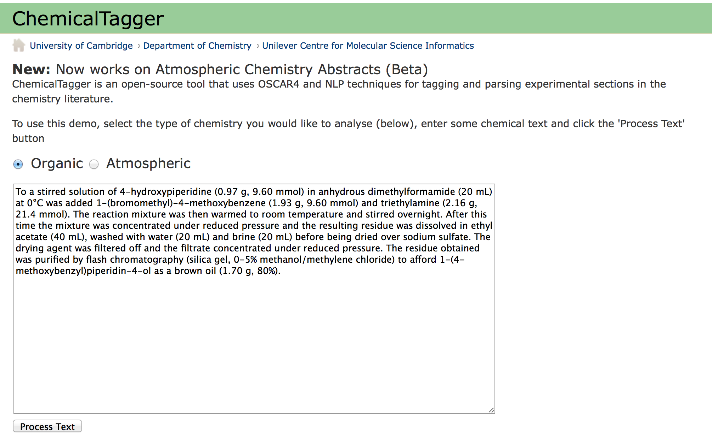
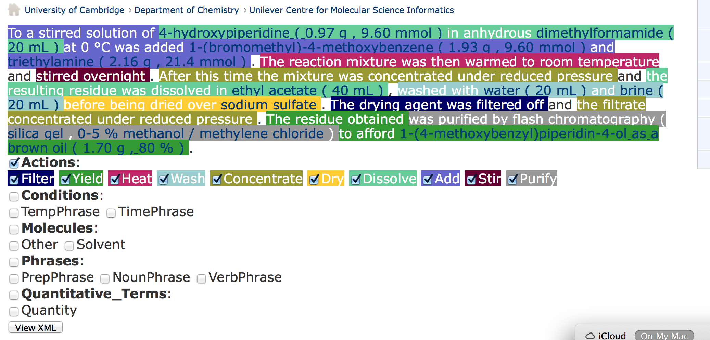
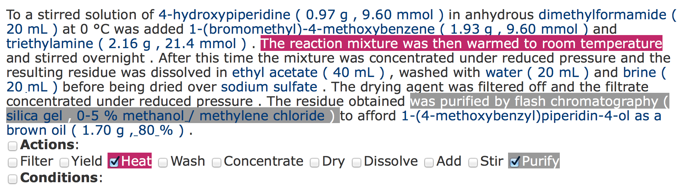
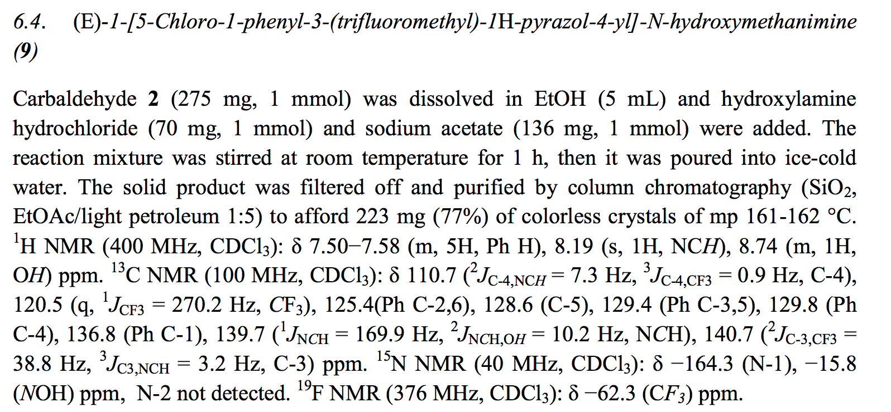
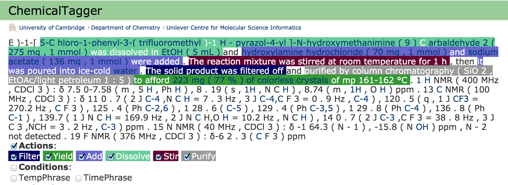

# ChemicalTagger

A tool that completely parses chemical text and interprets syntetic procedures. 
## online demo

see http://chemicaltagger.ch.cam.ac.uk .

 * before annotation:
 
  
 * immediate effect of annotation after clicking "Process Text" 
 
  
 * showing just one 
  
 * 
  
 * 
 
 