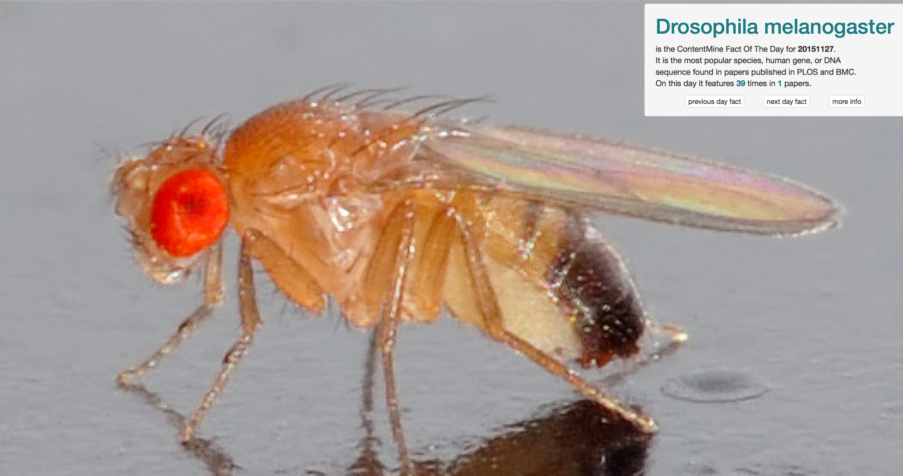

# Fact of the Day

Every day the documents are searched for Facts - species, or genes. There are some false positives, but on the whole it's quite fun. Where possible we link to an image from Wikipedia

## online demo

see http://fotd.contentmine.org eacg Fact points to the previous and the next. There are some places with a few blank days but generally you can find some nice pictures.

 * 
 * 
 
 