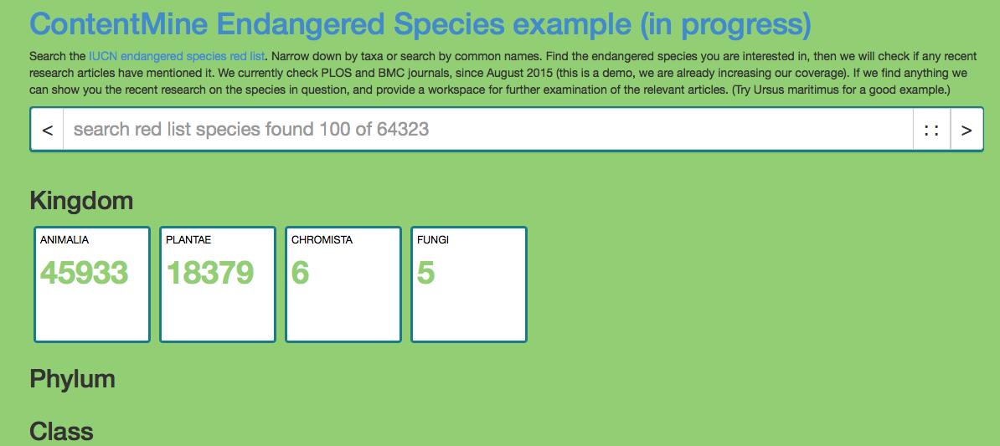
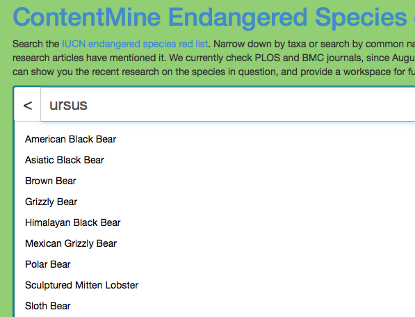
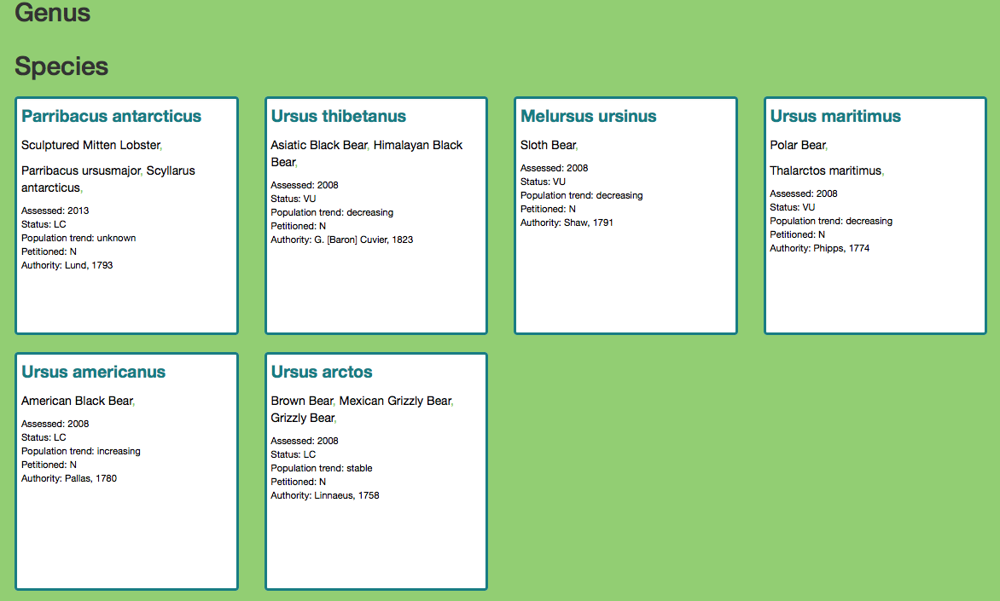
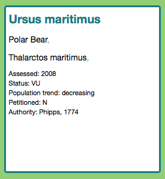
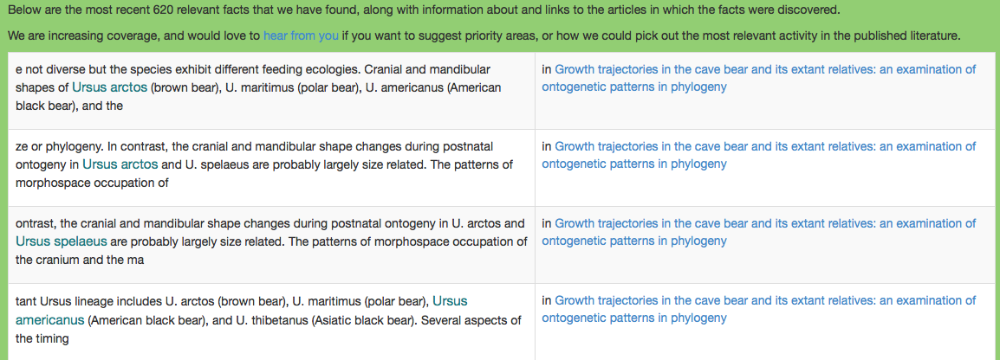
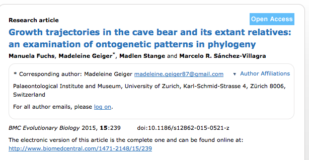

# IUCN

See http://iucn.org for general background

## online demo

Facts are harvested daily and filtered against IUCN species, results are displayed at http://iucn.contentmine.org .

 * The landing page: 
  

 * we search for `ursus`, and note the bear species 
   
 * When entered we get a list of species with `ursus` 
  
  
we'll select `Ursus maritimus`: 
   
 * All the hits for "ursus". (left) in textual context; on the right the title of the article they were located in 
   
 * and the actual article 
   
 
 
