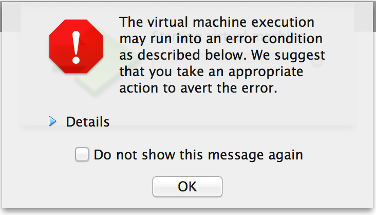
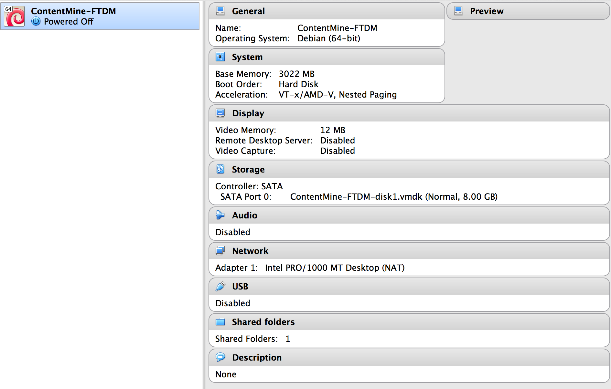
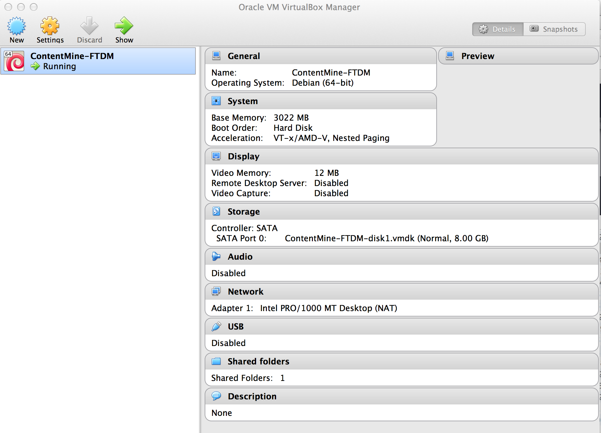
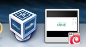
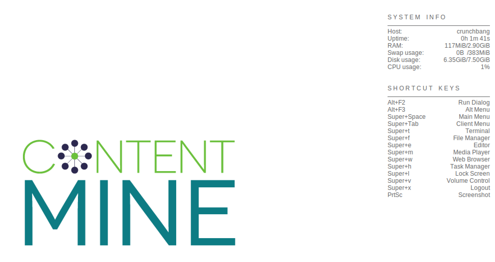
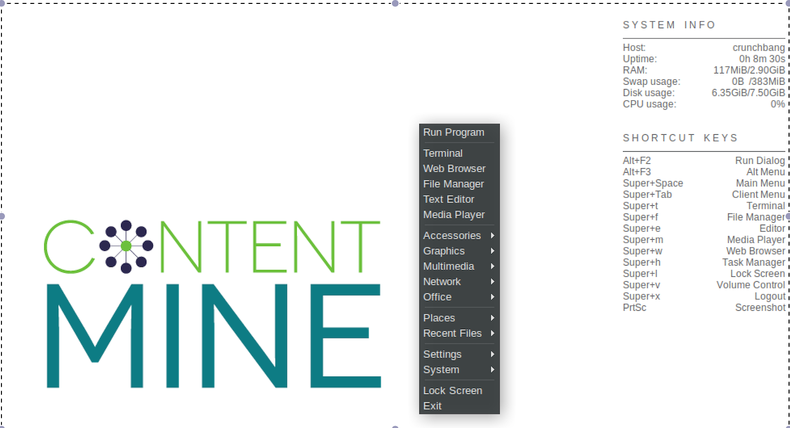
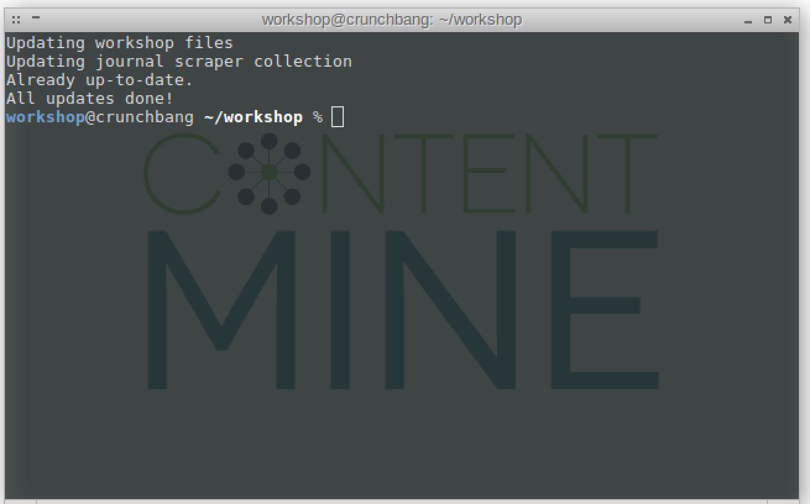

.png)

Installing ContentMine resources

# Table of contents

1. [Installation of the ContentMine-VirtualMachine](#installation)

2. [Screenshots of installation](#screenshots)

## INSTALLATION

You will normally have been told by email or on the event page about:

 * installing Virtual Box (the generic (ORACLE) software to run virtual machines)
 * downloading a Virtual Machine (the actual collection of software required for the tutorial)
 
By default the installation of the software is given in the [software-tutorials package] (../software-tutorials/vms/README.md). Note that some VMs have a German locale and you may need to issue:
```setxkbmap gb ``` or
```setxkbmap us```


## SCREENSHOTS

This is a series of screenshots to show what you should be seeing when you first install the Virtual Box and Virtual Machine. These are for a MAC-OSX and there will be minor differences for other OS.


 * Virtual Box Download (e.g. from https://www.virtualbox.org/wiki/Downloads);<br/>

<br/>Pick your operating system
<br/>


 * Virtual Box Installation: <br/>
 (MAC-OSX) click on downloaded file (creates <br/>

<br/>
Then click on the package/box icon (1) and it should install in `Applications | VirtualBox.app`

* Possible error (ignore). You might see:<br/>

<br/>
If so, click the "Do not show this message again" and continue.
<br/>

* Starting the VM. (MAC-OSX) Click on the `Applications | VirtualBox.app` and you may see<br/>

<br/>

* When the VM is ready and you will see<br/>

<br/>
(and on MAC-OSX the icons:<br/>
)

There can be more than one VM - we release different ones for different tutorials, and you can switch between them on the LH side.

* when the VM is running you should see a screen such as:

<br/>

* Right-click on the main window and get a popup:

<br/>


 * Select `terminal` and you will get:

<br/>

 
 


