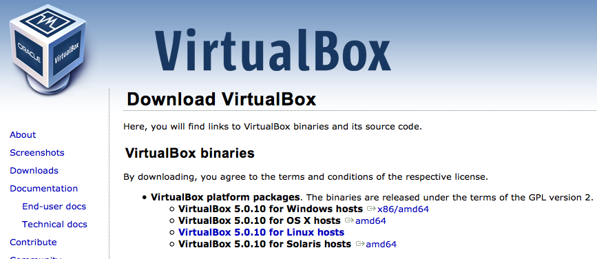
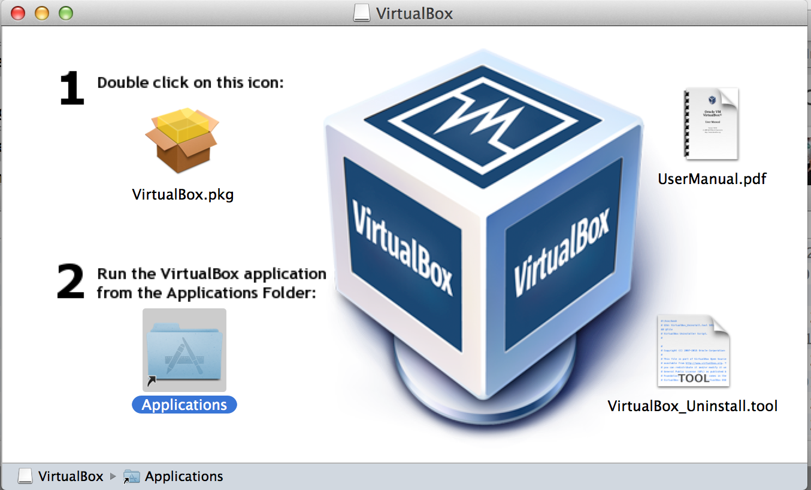

.png)

Installing ContentMine resources

# Table of contents

1. [Installation of the ContentMine-VirtualMachine](#installation)

2. [Screenshots of installation](#screenshots)

## INSTALLATION

You will normally have been told by email or on the event page about:

 * installing Virtual Box (the generic (ORACLE) software to run virtual machines)
 * downloading a Virtual Machine (the actual collection of software required for the tutorial)
 
By default the installation of the software is given in the [software-tutorials package] (software-tutorials/vms/README.md)

## SCREENSHOTS

This is a series of screenshots to show what you should be seeing when you first install the Virtual Box and Virtual Machine. These are for a MAC-OSX and there will be minor differences for other OS.

 * Virtual Box Download: 

 * Virtual Box Installation: 

